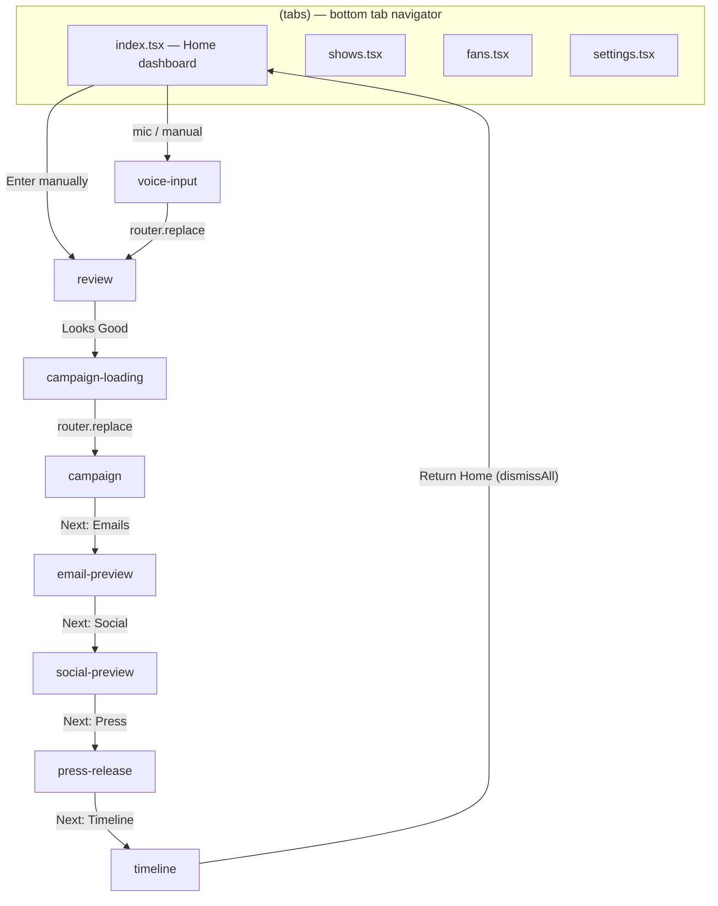
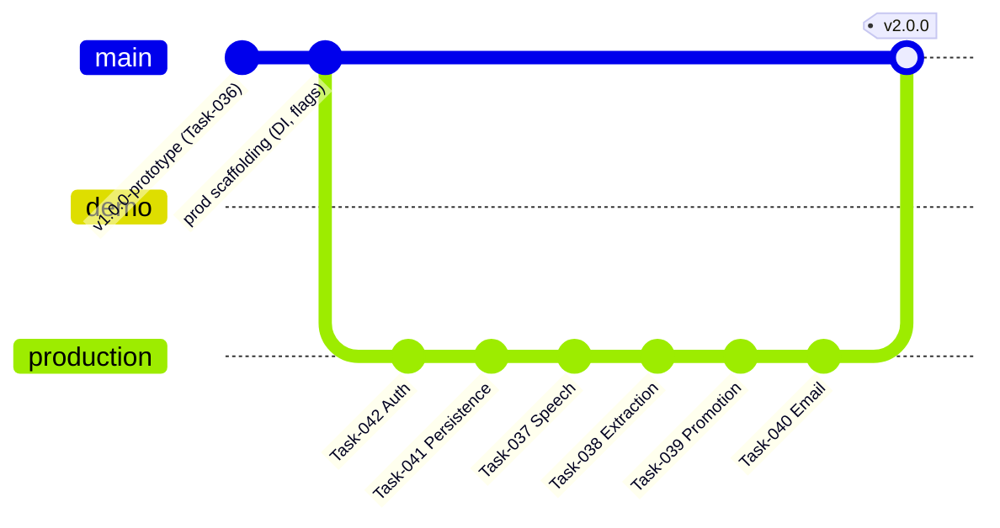
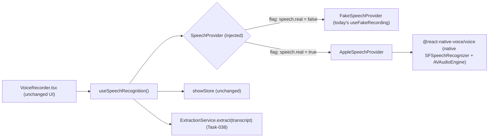
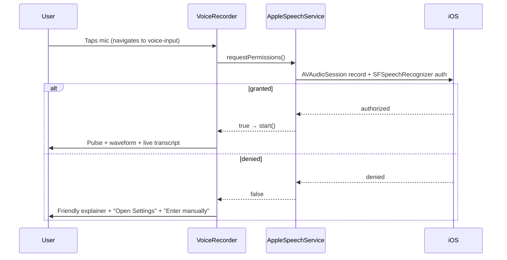
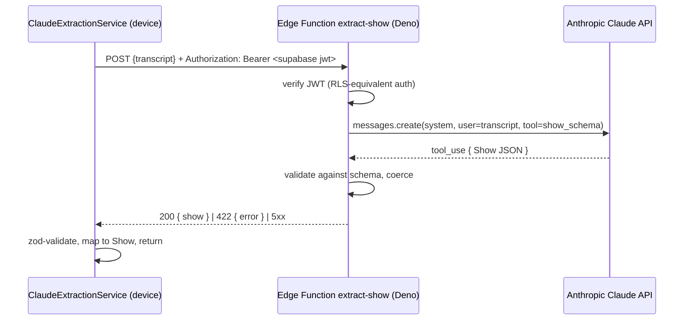
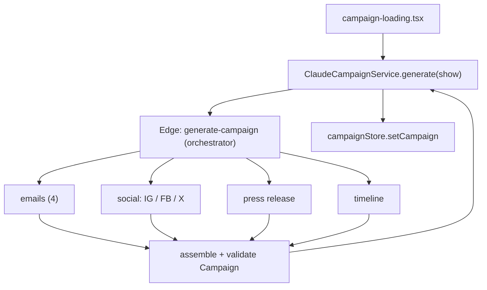
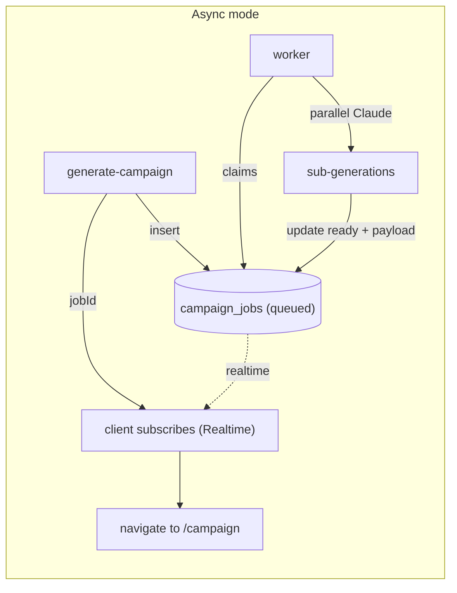
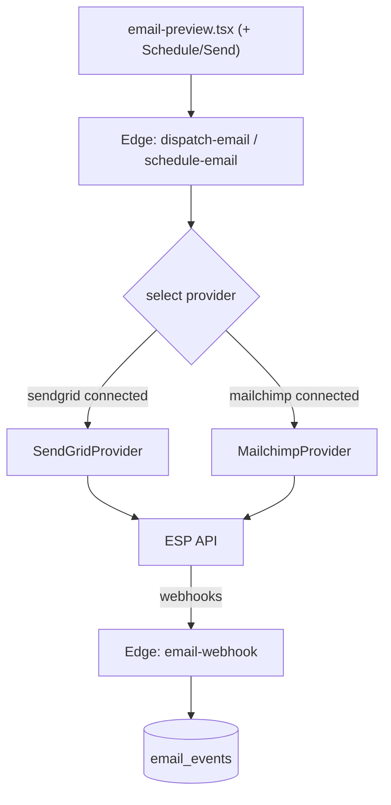
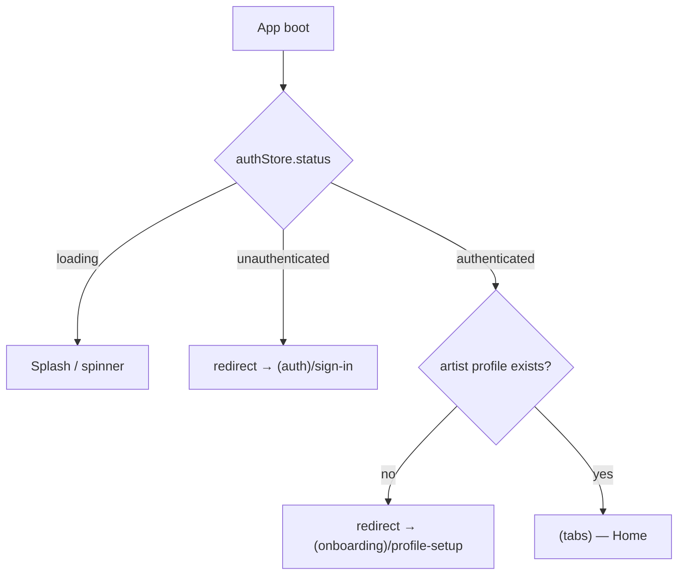
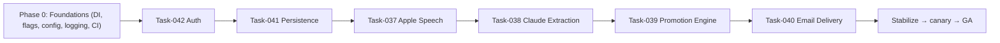

# GigLift — Production Hardening Engineering Specification

> **Status:** Canonical engineering contract for **Production v2**.
> **Supersedes:** Nothing. This is the first production specification.
> **Audience:** Any engineer (present or future) who will implement Production Tasks 037–042.
> **Authoring stance:** Written by a Senior Staff Engineer to stand on its own. If you are reading this five years from now with no other context, you should be able to implement every Production Task from this document alone.

---

## How to read this document

This document is organized into four layers:

1. **Context** — Executive Summary, Current Prototype Architecture, Production Philosophy. Read these first.
2. **Production Tasks** — Six self-contained task specifications (037 through 042). Each is independently implementable and includes Definition of Done, Acceptance Criteria, and Risks.
3. **Cross-Cutting Architecture** — Conventions that span all tasks (DI, secrets, logging, CI/CD, branch strategy). Read before starting any task.
4. **Governance** — Risk Register, Implementation Order, Future Work, Definition of Production Complete.

A single rule governs all production work:

> **Replace implementations behind existing interfaces. Never redesign the working UX.**

---

# Executive Summary

GigLift is a mobile application (Expo / React Native / TypeScript) that turns a musician's spoken description of an upcoming show into a complete, ready-to-run promotion campaign: announcement emails, social posts, a press release, and a scheduled timeline.

**Prototype v1** (Tasks 001–036) is complete. It implements the _entire_ user journey end-to-end with real navigation, real state management, a real design system, and a real database schema — but with **mocked implementations** of every external integration.

## Why Prototype v1 intentionally stops at Task-036

Prototype v1 exists for exactly one purpose: **to validate the user experience with stakeholders before any money or risk is spent on production integrations.**

The prototype deliberately stops at Task-036 because, at that point, every screen, transition, empty state, and success animation in the product journey is finished and demonstrable. A stakeholder can hold the app and experience the _complete_ GigLift narrative — Home → Voice → Review → Campaign Build → Email/Social/Press previews → Timeline → Home — without a single dead end or placeholder.

Continuing past Task-036 into production integrations _before_ that validation would be premature: it would commit engineering time, recurring API spend (Anthropic, SendGrid, Mailchimp), App Store review exposure, and privacy/compliance surface area to a product whose core UX has not yet been confirmed as the right one.

## Why mocked services exist

Mocks are not throwaway scaffolding; they are **deliberate seams**. Each external capability the product will eventually need is already represented in the prototype as one of the following:

| Capability                                       | Prototype mock                                                         | Seam type            |
| ------------------------------------------------ | ---------------------------------------------------------------------- | -------------------- |
| Voice capture & speech-to-text                   | `useFakeRecording` hook (scripted transcript, no audio)                | React hook           |
| AI extraction (transcript → structured Show)     | `MockExtractionService implements ExtractionService`                   | TypeScript interface |
| Campaign generation                              | `MockCampaignService implements CampaignService`                       | TypeScript interface |
| Demo content (fans, metrics, settings, timeline) | `DemoDataService` (single source of truth)                             | Module               |
| Email delivery / social posting                  | Copy-to-clipboard + mocked feedback in preview screens                 | UI affordance        |
| Authentication                                   | `authService` + `AuthProvider` + `authStore` built but **not mounted** | Service + provider   |
| Persistence (shows, campaigns, fans)             | In-memory Zustand stores + `DemoDataService`                           | Store                |

Because each mock sits behind a stable interface or a clearly bounded module, **production work replaces the implementation without touching the screens that consume it.**

## Why Production begins after market validation

Production v2 begins **only after Prototype v1 has been approved** by stakeholders. The approval gate protects the business from building the wrong thing well. Once the UX is validated, the work becomes a series of low-ambiguity, high-confidence _substitutions_: swap a mock for a real implementation behind an interface that already has a proven consumer.

## Production Tasks replace implementations rather than redesigning the application

This is the central engineering principle of the entire production phase. Every Production Task in this document is framed as a **replacement**:

- The screens do not change.
- The navigation graph does not change.
- The domain types (`Show`, `Campaign`, `Artist`, `Fan`, `PressRelease`) do not change shape unless a task explicitly versions them.
- The interfaces (`ExtractionService`, `CampaignService`) do not change signatures; only new classes implement them.

If a Production Task finds itself proposing UX changes, **stop** — that is a product decision, not a hardening task, and it belongs in a separate product cycle, not in this document's scope.

---

# Current Prototype Architecture

This section documents **what exists today**, exactly as it is in the repository at the end of Task-036. Production engineers must treat this as the ground truth they are evolving from.

## Technology stack (as pinned in `package.json`)

| Concern             | Library                                                | Version                                       |
| ------------------- | ------------------------------------------------------ | --------------------------------------------- |
| Runtime / framework | `expo`                                                 | `^56.0.12`                                    |
| UI runtime          | `react-native`                                         | `0.85.3` (New Architecture enabled)           |
| Language            | `react` / `react-dom`                                  | `19.2.3`                                      |
| Type system         | `typescript`                                           | `~6.0.3` (strict, `noUncheckedIndexedAccess`) |
| Routing             | `expo-router`                                          | `~56.2.11` (typed routes)                     |
| State               | `zustand`                                              | `^5.0.14`                                     |
| Animation           | `react-native-reanimated`                              | `4.3.1`                                       |
| Gestures            | `react-native-gesture-handler`                         | `~2.31.1`                                     |
| Backend SDK         | `@supabase/supabase-js`                                | `^2.108.2`                                    |
| Secure storage      | `expo-secure-store`                                    | `~56.0.4`                                     |
| Apple auth          | `expo-apple-authentication`                            | `~56.0.4`                                     |
| URL polyfill        | `react-native-url-polyfill`                            | `^3.0.0`                                      |
| Lint / format       | `eslint` `^9`, `prettier` `^3`, `husky`, `lint-staged` | —                                             |

**App configuration (`app.json`):** `scheme: "giglift"`, `newArchEnabled: true`, `ios.bundleIdentifier: "com.skaal.giglift"`, `ios.usesAppleSignIn: true`, plugins `[expo-router, expo-secure-store, expo-status-bar, expo-apple-authentication]`, `experiments.typedRoutes: true`.

## Folder structure

```
Skaal_GigLift/
├── app/                          # Expo Router routes (file-based)
│   ├── _layout.tsx               # Root Stack; header "Next" chain; transitions
│   ├── (tabs)/
│   │   ├── _layout.tsx           # Bottom tab navigator
│   │   ├── index.tsx             # Home dashboard (metrics + mic CTA)
│   │   ├── shows.tsx             # Shows tab (EmptyState)
│   │   ├── fans.tsx              # Fan list (search, filters, detail sheet)
│   │   └── settings.tsx          # Settings (profile, subscription, accounts…)
│   ├── profile-setup.tsx         # Artist profile form -> createArtist()
│   ├── voice-input.tsx           # Mounts <VoiceRecorder/>
│   ├── review.tsx                # Editable Show review card
│   ├── campaign-loading.tsx      # Spinner + rotating msgs -> generates campaign
│   ├── campaign.tsx              # Campaign review hub (tabbed)
│   ├── email-preview.tsx         # iPhone-style email preview
│   ├── social-preview.tsx        # Per-platform social preview
│   ├── press-release.tsx         # Structured press release viewer
│   └── timeline.tsx              # Vertical campaign timeline
├── components/
│   ├── AuthProvider.tsx          # Session bootstrap (NOT yet mounted)
│   ├── MetricCard.tsx
│   ├── NextHeaderButton.tsx
│   └── ui/                       # Design system primitives
│       ├── Button.tsx  Card.tsx  Text.tsx  Input.tsx
│       ├── Avatar.tsx  EmptyState.tsx  SuccessCheck.tsx
│       ├── MicIcon.tsx  glyphs.tsx
├── constants/                    # Design tokens
│   ├── colors.ts  spacing.ts  typography.ts  radius.ts  shadows.ts
├── features/                     # Feature-scoped components/hooks
│   ├── voice/
│   │   ├── components/VoiceRecorder.tsx  Waveform.tsx
│   │   └── hooks/useFakeRecording.ts     # ← speech mock lives here
│   ├── campaign/components/EmailPreviewCard.tsx  SocialPostCard.tsx  ReviewItemCard.tsx
│   └── fans/components/FanRow.tsx  FanDetailSheet.tsx
├── hooks/
│   ├── useAuth.ts                # Reactive auth state + action methods
│   └── useCountUp.ts             # Animated number count-up
├── services/
│   ├── authService.ts            # Supabase Auth wrapper (email + Apple)
│   ├── artistService.ts          # createArtist / getCurrentArtist (real Supabase)
│   ├── database.ts               # Re-exports the supabase singleton
│   ├── ai/
│   │   ├── ExtractionService.ts      # interface { extract(transcript): Promise<Show> }
│   │   └── MockExtractionService.ts  # returns DemoDataService.primaryShow
│   ├── campaign/
│   │   ├── CampaignService.ts        # interface { generate(show): Promise<Campaign> }
│   │   └── MockCampaignService.ts    # returns DemoDataService.buildCampaign(show)
│   └── demo/DemoDataService.ts   # Single source of truth for all demo data
├── stores/                       # Zustand stores
│   ├── authStore.ts  showStore.ts  campaignStore.ts
├── supabase/
│   ├── client.ts                 # createClient w/ SecureStore adapter
│   └── migrations/
│       ├── 20260627212600_init_schema.sql   # artists, shows, fans, campaigns, campaign_actions
│       └── 20260627213000_enable_rls.sql     # per-user RLS, artists.id = auth.users.id
├── types/                        # Domain models
│   ├── show.ts  campaign.ts  artist.ts  fan.ts  pressRelease.ts  timeline.ts
├── utils/                        # Pure business logic
│   ├── campaign.ts  showFields.ts  timeline.ts  fans.ts
├── .env.example                  # EXPO_PUBLIC_SUPABASE_URL / _ANON_KEY / _APP_ENV
├── app.json  tsconfig.json  eslint.config.js  package.json
```

## Screens & navigation

The app is a single **root Stack** wrapping a **bottom Tab navigator**. The Stack defines transition animations and a guided "Next" chain in the header (`NextHeaderButton`) that walks a stakeholder through the demo linearly. The native back button provides "Previous".



**Transition configuration (`app/_layout.tsx`):** default `slide_from_right`; `voice-input` uses `slide_from_bottom` (modal feel); `campaign-loading` uses `fade`. The header `Next` chain is wired as: `campaign → email-preview → social-preview → press-release → timeline`.

**Critical observation:** there is currently **no authentication gate** in navigation. `AuthProvider` exists but is **not mounted** in `app/_layout.tsx`, and there is no login screen. The app boots directly into the tabs. `profile-setup.tsx` calls the real `createArtist()` (which requires a Supabase session) but is not reachable from a guarded onboarding flow. Wiring this up is the subject of **Production Task-042**.

## State management

Three Zustand stores, all in-memory (no persistence middleware):

| Store           | Shape                                         | Purpose                                                                                 |
| --------------- | --------------------------------------------- | --------------------------------------------------------------------------------------- |
| `authStore`     | `{ session, user, status, setSession }`       | Mirror of Supabase session; `status: 'loading' \| 'authenticated' \| 'unauthenticated'` |
| `showStore`     | `{ currentShow, setCurrentShow, updateShow }` | The show being created/reviewed                                                         |
| `campaignStore` | `{ campaign, setCampaign }`                   | The generated campaign being reviewed                                                   |

State flows: voice extraction writes `showStore.currentShow`; review edits mutate it via `updateShow`; `campaign-loading` reads `currentShow`, generates a `Campaign`, and writes `campaignStore.campaign`; all preview screens read from `campaignStore`.

## Services & mock services

- **`ExtractionService` interface** — `extract(transcript: string): Promise<Show>`. Implemented by `MockExtractionService`, which ignores the transcript and returns a clone of `DemoDataService.primaryShow`. Instantiated at module scope in `VoiceRecorder.tsx` (`const extractionService: ExtractionService = new MockExtractionService()`).
- **`CampaignService` interface** — `generate(show: Show): Promise<Campaign>`. Implemented by `MockCampaignService`, which returns `DemoDataService.buildCampaign(show)`. Instantiated at module scope in `campaign-loading.tsx`.
- **`authService`** — thin, UI-agnostic wrapper over Supabase Auth: `getSession`, `signInWithEmail`, `signUpWithEmail`, `isAppleSignInAvailable`, `signInWithApple`, `signOut`, `onAuthStateChange`. **This is real, working code** against Supabase.
- **`artistService`** — `createArtist(input)` and `getCurrentArtist()` execute **real** Supabase queries against the `artists` table, deriving ownership from `auth.uid()`. This is the only domain table the client currently reads/writes.
- **`database.ts`** — re-exports the `supabase` singleton as the single data-access entry point. No repository layer yet.
- **`DemoDataService`** — the deterministic single source of truth for all non-`artists` demo content: the demo `artist`, `primaryShow`, `fallbackShow`, ten `fans`, `dashboardMetrics`, `connectedAccounts`, `subscription`, plus `buildCampaign(show)`, `buildPressRelease(show)`, a derived `campaign`, `pressRelease`, and `timeline`.

## Database (Supabase / Postgres)

Two SQL migrations define a complete schema **that the client does not yet fully use** (only `artists` is read/written today):

- **`artists`** — `id uuid PK` (in the RLS migration, redefined as FK to `auth.users.id`), `name`, `email unique`, `bio`, `genre_tags text[]`, `tone_keywords text[]`, `social_handles jsonb`, `created_at`.
- **`shows`** — `artist_id` FK, venue/address/date/time/price/link, `opening_acts text[]`, `genre_vibe`, `notes`, `status show_status`, `created_at`.
- **`fans`** — `artist_id` FK, `email`, name/location, `signup_source`, `tags text[]`, `engagement_score`, `opted_out`, `unique(artist_id, email)`.
- **`campaigns`** — `show_id` FK, `artist_id` FK, `status campaign_status`, `email_drafts jsonb`, `social_drafts jsonb`, `press_release text`, `created_at`.
- **`campaign_actions`** — `campaign_id` FK, `action_type campaign_action_type`, `platform`, `scheduled_at`, `sent_at`, `status campaign_action_status`, `content jsonb`.

Enums: `show_status('draft','active','complete')`, `campaign_status('building','review','approved','complete')`, `campaign_action_type('email','social_post','press_release')`, `campaign_action_status('scheduled','sent','failed','skipped')`.

**RLS:** enabled on all five tables, scoped to the `authenticated` role, ownership via `artist_id = auth.uid()` (and via parent campaign for `campaign_actions`). No `anon`/`public` access. `auth.uid()` is wrapped in a `(select …)` sub-select for per-statement caching.

> **Schema gap to be aware of:** there are **no `updated_at` columns** anywhere. Conflict resolution and cache invalidation in Production Task-041 will require adding them.

## Design system

Centralized tokens in `constants/`:

- **`colors`** — brand (`primary #6B21A8`, `primarySoft`, `accent`), surfaces, text, UI (`danger`, `info`, `success`), overlays (`scrim`, `recordingBackground`), and social brand accents (`instagram`, `facebook`, `x`). Exposed as a `const` object with a `ColorToken` union type.
- **`spacing`, `radius`, `typography`, `shadows`** — scalar token sets consumed by all components.

UI primitives in `components/ui/` (`Button`, `Card`, `Text`, `Input`, `Avatar`, `EmptyState`, `SuccessCheck`, `MicIcon`, `glyphs`) are the only sanctioned building blocks; screens compose these rather than re-styling primitives.

## What is real vs. mocked (summary)

| Layer                                | Real today       | Mocked today                     |
| ------------------------------------ | ---------------- | -------------------------------- |
| Navigation / screens / design system | ✅ Fully real    | —                                |
| Auth service + provider + store      | ✅ Code real     | ⚠️ Not mounted / not gating      |
| `artists` table read/write           | ✅ Real Supabase | —                                |
| Voice capture                        | —                | ❌ `useFakeRecording` (no audio) |
| Speech-to-text                       | —                | ❌ scripted transcript           |
| Extraction                           | —                | ❌ `MockExtractionService`       |
| Campaign generation                  | —                | ❌ `MockCampaignService`         |
| Shows/campaigns/fans persistence     | —                | ❌ in-memory + `DemoDataService` |
| Email / social delivery              | —                | ❌ clipboard + toast             |

---

# Production Philosophy

These are the non-negotiable principles that govern every Production Task. They exist to keep a validated product from regressing while it gains real integrations.

## 1. Prototype First, Production Second

The prototype proved _what_ to build. Production decides _how_ to make it real. We never re-litigate the _what_ during hardening. If a real integration reveals a UX problem, we file a product issue and continue with a faithful implementation of the existing UX; we do not silently redesign.

## 2. Interface-driven architecture

Every external capability is consumed through a TypeScript interface or a clearly bounded module. The prototype already establishes two first-class interfaces (`ExtractionService`, `CampaignService`) and several implicit seams (`useFakeRecording`, `DemoDataService`, the `authService`/`artistService` modules). Production adds the _real_ implementations behind those same contracts.

**Rule:** a screen must never import a concrete service class for an external capability. It depends on the interface (or a hook/provider) and receives the implementation via injection (see Cross-Cutting Architecture → Dependency Injection).

## 3. Dependency inversion

High-level policy (screens, stores) must not depend on low-level detail (HTTP clients, SDKs, native modules). Both depend on abstractions. Concretely:

```
Screen ──depends on──▶ Interface ◀──implements── ConcreteService ──uses──▶ SDK / native module
```

This is why production "feels small": we are inverting only the leaf nodes.

## 4. Replace implementations, never redesign working UX

| Allowed in a Production Task                       | Not allowed in a Production Task                                  |
| -------------------------------------------------- | ----------------------------------------------------------------- |
| Add a new class implementing an existing interface | Change a screen's layout or copy                                  |
| Add new services, repositories, Edge Functions     | Rename or reshape `Show`/`Campaign` without a versioned migration |
| Add migrations (additive)                          | Remove or reorder navigation routes                               |
| Add env vars, secrets, feature flags               | Change the demo narrative                                         |
| Swap a mock for a real impl via DI                 | Introduce a new design language                                   |

## 5. Minimize risk

Every task ships behind a **feature flag** and is **rollback-safe**. The mock implementations remain in the codebase as the fallback. A flag flip (or a failed health check) returns the app to a known-good mocked state. We never delete a mock until its real counterpart has been in production, flagged-on, for a full release cycle without regression.

## 6. Maintain a demo branch

The validated prototype must remain demonstrable **forever**, independent of production progress. We preserve a long-lived `demo` branch (and a tagged release `v1.0.0-prototype`) whose build always runs entirely on mocks. Sales, stakeholder demos, and onboarding use this build with zero dependency on live APIs, network, or secrets.

## 7. Production branch strategy



- **`main`** — integration branch; always releasable; mocks remain available behind flags.
- **`demo`** — frozen prototype lineage; mock-only; used for stakeholder demos.
- **`production`** — staging integration line for the v2 task series; merges to `main` per task via PR.
- **`feature/task-0XX-*`** — one branch per Production Task; squash-merged into `production` (then `production` → `main`).

Detailed merge/rollback mechanics are in **Cross-Cutting Architecture**.

---

# Production Task-037 — Apple Speech Integration

## Purpose

Replace the scripted `useFakeRecording` hook with **real microphone capture and on-device speech-to-text** on iOS, producing a live, growing transcript that feeds the existing extraction pipeline. The user experience (mic button, pulse animation, waveform, live transcript, "Stop Recording", "Processing…") must remain pixel-identical; only the _source_ of the transcript changes from a timer to Apple's `SFSpeechRecognizer`.

## Architecture

We introduce a **`SpeechRecognitionProvider`** abstraction. The prototype's `useFakeRecording` becomes one of two providers behind a single hook `useSpeechRecognition`, selected via DI/feature flag.



On-device recognition is chosen as the default (`requiresOnDeviceRecognition = true` where supported) for privacy, latency, and to avoid Apple's server-side recognition limits. We fall back to Apple's server recognition only if on-device is unavailable for the device locale.

## Interfaces

```typescript
// services/speech/SpeechRecognitionService.ts
export type SpeechStatus = 'idle' | 'authorizing' | 'listening' | 'processing' | 'error';

export type SpeechResult = {
  /** Best-guess transcript so far (interim) or final transcript. */
  transcript: string;
  /** True once the recognizer marks this result final. */
  isFinal: boolean;
};

export type SpeechError =
  | { code: 'permission_denied' }
  | { code: 'unavailable' } // recognizer not available for locale/device
  | { code: 'no_speech' } // silence / nothing recognized
  | { code: 'recognition_failed'; message: string };

export interface SpeechRecognitionService {
  /** Returns true if mic + speech permission are granted (requesting if needed). */
  requestPermissions(): Promise<boolean>;
  /** Begin capture. Calls onResult on each interim/final result. */
  start(opts: {
    locale?: string; // default device locale, e.g. "en-US"
    onResult: (r: SpeechResult) => void;
    onError: (e: SpeechError) => void;
  }): Promise<void>;
  /** Stop capture; resolves with the final transcript (best available). */
  stop(): Promise<string>;
  /** Hard-cancel without producing a result. */
  cancel(): Promise<void>;
}
```

The consuming hook keeps the prototype's public shape so `VoiceRecorder.tsx` is untouched:

```typescript
// features/voice/hooks/useSpeechRecognition.ts (new) — same surface as useFakeRecording
type UseSpeechResult = {
  transcript: string;
  isRecording: boolean;
  isProcessing: boolean;
  stop: () => void;
};
```

## Files affected / to create / to modify

| Action               | Path                                           | Notes                                                                                                            |
| -------------------- | ---------------------------------------------- | ---------------------------------------------------------------------------------------------------------------- |
| Create               | `services/speech/SpeechRecognitionService.ts`  | Interface above                                                                                                  |
| Create               | `services/speech/AppleSpeechService.ts`        | `implements SpeechRecognitionService` via `@react-native-voice/voice`                                            |
| Create               | `services/speech/FakeSpeechService.ts`         | Wraps existing scripted logic from `useFakeRecording` behind the interface                                       |
| Create               | `features/voice/hooks/useSpeechRecognition.ts` | Hook that adapts a `SpeechRecognitionService` to the existing `{transcript,isRecording,isProcessing,stop}` shape |
| Modify               | `features/voice/components/VoiceRecorder.tsx`  | Swap `useFakeRecording` → `useSpeechRecognition` (DI-injected service); **no UI change**                         |
| Keep (do not delete) | `features/voice/hooks/useFakeRecording.ts`     | Retain as fallback until Definition of Production Complete                                                       |
| Modify               | `app.json`                                     | Add iOS usage descriptions + plugin config (below)                                                               |
| Modify (DI)          | `services/container.ts` (see Cross-Cutting)    | Register chosen `SpeechRecognitionService` by flag                                                               |

## Dependencies & Expo packages

- **`@react-native-voice/voice`** — wraps `SFSpeechRecognizer` + `AVAudioEngine`, exposes interim results, on-device flag, and locale. This requires a **custom dev client / prebuild** (it is a native module). The project already has `newArchEnabled: true`; verify the chosen version supports the New Architecture (TurboModules) or pin a compatible version and run via `expo prebuild`.
- Alternative if `@react-native-voice/voice` lags New Architecture support: author a **thin local Expo config plugin + native module** exposing the same interface. The interface above is intentionally minimal so either backing is acceptable.

> **Engineering decision:** we standardize on `@react-native-voice/voice` because it is the most widely used RN binding for `SFSpeechRecognizer`, exposes interim results (required for the live transcript UX), and supports on-device recognition. The `SpeechRecognitionService` interface insulates us if we must replace it later.

## Native iOS permissions & Info.plist

Apple requires two usage-description strings; missing either causes an immediate crash on first use and **App Store rejection**.

| Key                                   | Purpose        | Value (user-facing)                                                                     |
| ------------------------------------- | -------------- | --------------------------------------------------------------------------------------- |
| `NSMicrophoneUsageDescription`        | Mic capture    | "GigLift uses your microphone so you can describe your show out loud."                  |
| `NSSpeechRecognitionUsageDescription` | Speech-to-text | "GigLift turns your spoken show description into a ready-to-edit show, on your device." |

## `app.json` changes

```json
{
  "expo": {
    "ios": {
      "infoPlist": {
        "NSMicrophoneUsageDescription": "GigLift uses your microphone so you can describe your show out loud.",
        "NSSpeechRecognitionUsageDescription": "GigLift turns your spoken show description into a ready-to-edit show, on your device."
      }
    },
    "plugins": [
      "expo-router",
      "expo-secure-store",
      "expo-status-bar",
      "expo-apple-authentication",
      "@react-native-voice/voice"
    ]
  }
}
```

After editing `app.json`, run `npx expo prebuild --clean` and build a custom dev client (`eas build --profile development` or `expo run:ios`). The mock-only Expo Go workflow no longer covers the speech path; the `demo` branch remains on the mock provider so it still runs in Expo Go.

## Permission flow



Denial must **not** dead-end the user: show a design-system `EmptyState`-style explainer with a button to `Linking.openSettings()` and a secondary "Enter show manually" that seeds `showStore` and routes to `/review` (mirroring the existing Home manual-entry affordance).

## Speech session lifecycle

1. **Mount** `voice-input` → request permissions.
2. **Authorized** → `start({ onResult, onError })`; transcript updates drive the same `transcript` state the UI already renders.
3. **User taps "Stop Recording"** → enter `processing`, call `stop()`, await final transcript.
4. **Final transcript** → `setCurrentShow(await extractionService.extract(transcript))` → `router.replace('/review')` (identical to today).
5. **Unmount / Cancel** → `cancel()`, tear down `AVAudioEngine`, deactivate audio session, remove listeners.

Edge cases the lifecycle must handle: app backgrounded mid-recording (auto-stop, deactivate session), interruption by phone call (`AVAudioSession` interruption → graceful stop), and silence/no-speech (`no_speech` → friendly retry).

## Speech provider interface & AppleSpeechService

`AppleSpeechService` maps `@react-native-voice/voice` events to the interface:

- `onSpeechResults` / `onSpeechPartialResults` → `onResult({ transcript, isFinal })`.
- `onSpeechError` → mapped to `SpeechError` codes.
- `start` sets `requiresOnDeviceRecognition = true` when `await Voice.isAvailable()` and on-device supported; sets locale from device.
- `stop` calls `Voice.stop()` and resolves with the last final (or best interim) transcript.

## Replacement strategy for FakeSpeechService

1. Extract the scripted logic from `useFakeRecording` into `FakeSpeechService implements SpeechRecognitionService` (preserving the staged transcript for demos).
2. Implement `useSpeechRecognition(service)` that adapts either provider to the existing hook shape.
3. Point `VoiceRecorder` at `useSpeechRecognition`, resolving the service from the DI container by flag `flags.speech.useReal`.
4. Default flag **off** (Fake) in all environments until acceptance criteria pass on device, then on for `development` → `staging` → `production`.

## Failure handling

| Failure                           | Behavior                                                         |
| --------------------------------- | ---------------------------------------------------------------- |
| Permission denied                 | Explainer + Open Settings + manual entry; never crash            |
| Recognizer unavailable for locale | Toast + manual entry; log `unavailable`                          |
| No speech detected                | "Didn't catch that — tap to try again"; stay on screen           |
| Recognition error mid-session     | Stop, keep partial transcript, allow continue-to-review or retry |
| Audio session interruption        | Auto-stop, offer resume                                          |

## Testing strategy

- **Unit:** `FakeSpeechService` deterministic transcript; `useSpeechRecognition` reducer transitions (`idle→listening→processing→done`); error mapping in `AppleSpeechService` (mock the native module).
- **Integration (mocked native):** jest mock of `@react-native-voice/voice` driving result/error callbacks; assert `showStore` + navigation outcomes.
- **Device/manual (required, cannot be automated):** real iPhone, on-device recognition, permission grant + deny paths, background interruption, airplane mode (on-device should still work), long (60s) dictation.
- **Accessibility:** VoiceOver labels on mic and stop; reduced-motion respected by existing animations.

## Rollback strategy

Flip `flags.speech.useReal = false`. The app instantly reverts to `FakeSpeechService`. No build or store submission required if the flag is remotely controlled (see Cross-Cutting → Feature flags). Because `useFakeRecording`/`FakeSpeechService` remain in the bundle, rollback is total and immediate.

## Definition of Done

- [ ] `SpeechRecognitionService` interface created; `AppleSpeechService` and `FakeSpeechService` both implement it.
- [ ] `useSpeechRecognition` adapts either provider to the existing hook shape; `VoiceRecorder.tsx` UI unchanged.
- [ ] `app.json` includes both Info.plist strings and the native plugin; `expo prebuild` + dev client build succeed.
- [ ] Permission grant/deny/no-speech/interruption paths all handled without crashes or dead ends.
- [ ] Feature flag gates real vs. fake; default fake; documented rollout.
- [ ] `useFakeRecording`/`FakeSpeechService` retained as fallback.
- [ ] Unit + mocked-integration tests pass in CI; device test checklist signed off.
- [ ] `npm run typecheck`, `npm run lint`, `npm run format:check` clean.

## Acceptance Criteria

1. On a physical iPhone, speaking a show description produces a live, growing transcript visually identical to the prototype.
2. Tapping "Stop Recording" routes to `/review` with a `Show` extracted from the _spoken_ transcript (via Task-038 or, pre-038, the mock extractor fed the real transcript).
3. Denying microphone/speech permission shows an explainer and a working manual-entry path; the app never crashes.
4. With the flag off, behavior is byte-for-byte the prototype.
5. No regression in the `demo` branch (still runs in Expo Go on the fake provider).

## Risks

| Risk                                                         | Severity | Mitigation                                                                                  |
| ------------------------------------------------------------ | -------- | ------------------------------------------------------------------------------------------- |
| `@react-native-voice/voice` New Architecture incompatibility | High     | Pin compatible version; fallback to local config-plugin native module behind same interface |
| Requires leaving Expo Go (custom dev client)                 | Medium   | Keep `demo` branch on fake provider for Expo Go demos                                       |
| On-device recognition unavailable on older devices/locales   | Medium   | Server fallback + manual entry                                                              |
| App Store rejection for missing/weak usage strings           | High     | Provide clear, specific purpose strings (above)                                             |
| Audio session conflicts (music apps)                         | Low      | Configure `AVAudioSession` category `record`, deactivate on stop                            |

## Future enhancements

- Multi-locale recognition and UI hints for non-`en-US` artists.
- Real-time amplitude metering to drive the waveform from actual audio levels.
- Re-record / append segments without losing prior transcript.
- Android speech (`SpeechRecognizer`) behind the same interface.

---

# Production Task-038 — Claude Extraction

## Purpose

Replace `MockExtractionService` with a real implementation that uses Anthropic's Claude to convert a free-form transcript into a structured, validated `Show`. The consumer (`VoiceRecorder` via `ExtractionService.extract`) does not change. The output must conform exactly to the existing `Show` type.

## Critical security constraint

The Anthropic API key is a **server secret** and must **never** ship in the client bundle. In Expo, any `EXPO_PUBLIC_*` variable is embedded in the app and is therefore **not secret**. Therefore Claude is **not called from the device**. We introduce a **Supabase Edge Function** (`extract-show`, Deno runtime) as a Backend-for-Frontend (BFF). The device calls the Edge Function with the user's Supabase JWT; the Edge Function holds the Anthropic key via Supabase secrets and calls Claude.



## LLM architecture

- **Model:** a current Claude model (e.g. the latest `claude-*-sonnet`) selected via env (`ANTHROPIC_MODEL`) so it can be upgraded without code changes.
- **Structured output:** use **tool use** (function calling) with a single tool whose `input_schema` mirrors the `Show` type. This forces Claude to emit JSON conforming to the schema rather than prose, dramatically reducing parsing failures.
- **Determinism:** `temperature: 0` for extraction (we want faithful structuring, not creativity).
- **Statelessness:** each call is independent; no conversation memory.

## Prompt pipeline

```
transcript ──▶ buildSystemPrompt() ──▶ buildUserMessage(transcript)
            ──▶ Claude (tool: extract_show, schema) ──▶ tool_use.input
            ──▶ validate(schema) ──▶ normalize() ──▶ Show
```

## Prompt templates

**System prompt (stored in `supabase/functions/extract-show/prompts.ts`):**

```
You are GigLift's show-extraction engine. You convert a musician's spoken,
informal description of ONE upcoming live show into structured data.

Rules:
- Extract only what is stated or strongly implied. Never invent venues, prices, or dates.
- If a field is unknown, return an empty string for text fields, an empty array for
  openingActs, and 0 for ticketPrice. Do not guess.
- Normalize date to a human-readable form like "August 15, 2026" when a date is given.
- Normalize time to "8:00 PM" style.
- ticketPrice is a number in the artist's local currency, without symbols.
- Always call the extract_show tool exactly once. Never reply with prose.
```

**User message:** the raw transcript string, verbatim.

**Tool definition (`input_schema`) mirrors `types/show.ts`:**

```json
{
  "name": "extract_show",
  "description": "Return the structured show described by the transcript.",
  "input_schema": {
    "type": "object",
    "additionalProperties": false,
    "required": [
      "venue",
      "city",
      "date",
      "time",
      "ticketPrice",
      "ticketLink",
      "openingActs",
      "genre",
      "notes"
    ],
    "properties": {
      "venue": { "type": "string" },
      "city": { "type": "string" },
      "date": { "type": "string" },
      "time": { "type": "string" },
      "ticketPrice": { "type": "number", "minimum": 0 },
      "ticketLink": { "type": "string" },
      "openingActs": { "type": "array", "items": { "type": "string" } },
      "genre": { "type": "string" },
      "notes": { "type": "string" }
    }
  }
}
```

## Extraction schema (client-side validation)

The device re-validates the Edge Function response with a schema so a bad/compromised response can never poison the store. Introduce **`zod`** as the validation library (added as a normal dependency; it is not a secret-bearing package):

```typescript
// services/ai/showSchema.ts
import { z } from 'zod';
export const showSchema = z.object({
  venue: z.string(),
  city: z.string(),
  date: z.string(),
  time: z.string(),
  ticketPrice: z.number().min(0),
  ticketLink: z.string(),
  openingActs: z.array(z.string()),
  genre: z.string(),
  notes: z.string(),
}); // .parse() yields a value assignable to Show
```

## Validation

Three layers:

1. **Edge Function:** validates Claude's `tool_use.input` against the JSON schema; rejects/repairs before responding.
2. **Transport:** HTTP status codes (`200` ok, `422` unprocessable, `429` rate limited, `5xx` upstream).
3. **Client:** `showSchema.parse(response.show)`; on failure, treat as `recognition_failed` and offer manual review with whatever partial data exists.

## Retry strategy

- **Edge → Claude:** up to **2 retries** with exponential backoff + jitter on `429`/`5xx`/timeout (base 500ms, factor 2, max 4s). Total budget ≤ ~10s.
- **Device → Edge:** **1 retry** on network failure; otherwise surface a friendly error and fall back to manual review (seed `showStore` with `DemoDataService.fallbackShow` shape so the Review screen is editable, never empty).
- Retries are **idempotent** (no side effects in extraction), so they are safe.

## Malformed response handling

| Case                               | Handling                                                                        |
| ---------------------------------- | ------------------------------------------------------------------------------- |
| Claude returns prose, not tool_use | Edge retries once with a stricter reminder; else `422`                          |
| JSON fails schema                  | Edge attempts a single "repair" call asking Claude to fix to schema; else `422` |
| Client schema parse fails          | Route to `/review` with empty editable fields + non-blocking toast              |
| Empty transcript                   | Short-circuit before calling Claude; return empty `Show`                        |

## Rate limiting

- **Per-user:** enforce in the Edge Function (e.g. token-bucket keyed by `auth.uid()` in a `rate_limits` table or KV): max N extractions/min and M/day. Return `429` with `Retry-After`.
- **Global:** respect Anthropic account limits; the backoff above absorbs transient `429`s.
- **Cost guardrail:** cap transcript length (e.g. truncate > 4,000 chars) before sending.

## Secrets

Stored via Supabase **Function Secrets** (never in the repo, never `EXPO_PUBLIC_`):

| Secret              | Scope                                 |
| ------------------- | ------------------------------------- |
| `ANTHROPIC_API_KEY` | Edge Function only                    |
| `ANTHROPIC_MODEL`   | Edge Function only (default model id) |

## Environment variables

| Variable                        | Where  | Secret?     | Purpose                                      |
| ------------------------------- | ------ | ----------- | -------------------------------------------- |
| `EXPO_PUBLIC_SUPABASE_URL`      | client | no          | already exists; used to reach Edge Functions |
| `EXPO_PUBLIC_SUPABASE_ANON_KEY` | client | no          | already exists                               |
| `EXPO_PUBLIC_EXTRACTION_FN`     | client | no          | function name/path, default `extract-show`   |
| `ANTHROPIC_API_KEY`             | Edge   | **yes**     | Claude auth                                  |
| `ANTHROPIC_MODEL`               | Edge   | no (server) | model id                                     |

## Service interfaces

No interface change. New class:

```typescript
// services/ai/ClaudeExtractionService.ts
export class ClaudeExtractionService implements ExtractionService {
  async extract(transcript: string): Promise<Show> {
    if (!transcript.trim()) return emptyShow();
    const res = await callEdgeFunction('extract-show', { transcript }); // attaches supabase JWT
    return showSchema.parse(res.show);
  }
}
```

## Files affected / to create / to modify

| Action        | Path                                                                                  |
| ------------- | ------------------------------------------------------------------------------------- |
| Create        | `supabase/functions/extract-show/index.ts` (Deno Edge Function)                       |
| Create        | `supabase/functions/extract-show/prompts.ts`                                          |
| Create        | `supabase/functions/_shared/anthropic.ts`, `_shared/auth.ts`, `_shared/rateLimit.ts`  |
| Create        | `services/ai/ClaudeExtractionService.ts`                                              |
| Create        | `services/ai/showSchema.ts` (zod)                                                     |
| Create        | `services/net/edgeClient.ts` (typed Edge Function caller w/ JWT)                      |
| Modify (DI)   | `services/container.ts` — bind `ExtractionService` by flag `flags.extraction.useReal` |
| Keep          | `services/ai/MockExtractionService.ts` (fallback)                                     |
| Add migration | `rate_limits` table (+ RLS) if DB-backed limiting chosen                              |

## Replacement strategy

1. Build and deploy `extract-show` Edge Function; verify with `curl` + a service JWT.
2. Implement `ClaudeExtractionService` + `showSchema` + `edgeClient`.
3. Register in DI behind `flags.extraction.useReal` (default off).
4. Enable in `development`, dogfood with real transcripts from Task-037, then `staging` → `production`.

## Testing

- **Unit:** `showSchema` accepts/rejects fixtures; `ClaudeExtractionService` against a mocked `edgeClient` (happy, `422`, `429`, network fail, malformed).
- **Edge Function tests (Deno):** prompt assembly; schema validation; retry/repair logic with a mocked Anthropic client; auth rejection without JWT; rate-limit `429`.
- **Contract test:** golden transcripts → expected `Show` (allowing for model nondeterminism by asserting key fields, not exact prose).
- **Manual:** end-to-end on device from spoken input (Task-037) through Review.

## Definition of Done

- [ ] `extract-show` Edge Function deployed; secrets configured; JWT-gated.
- [ ] `ClaudeExtractionService` + zod schema + edge client implemented and DI-bound by flag.
- [ ] Retry, repair, rate-limit, and malformed-response paths implemented and tested.
- [ ] No secret appears in the client bundle (verified by grepping the built bundle for the key — absent).
- [ ] `MockExtractionService` retained; flag default off; rollout documented.
- [ ] typecheck / lint / format clean; unit + Edge tests pass in CI.

## Acceptance Criteria

1. A spoken/typed transcript yields a `Show` whose fields reflect the actual content (venue, city, date, etc.).
2. Unknown fields come back empty/zero (never hallucinated).
3. A forced upstream failure degrades gracefully to an editable Review screen with a toast — never a crash or blank screen.
4. The Anthropic key is absent from the client bundle.
5. Flag off → identical to prototype (mock extraction).

## Future improvements

- Stream partial extraction to pre-fill Review fields as the user finishes speaking.
- Few-shot examples in the system prompt tuned from real failure cases.
- Confidence scores per field to highlight low-confidence values for review.
- Multi-show extraction ("I have three gigs next month…").

---

# Production Task-039 — Promotion Engine

## Purpose

Replace `MockCampaignService` with a real **promotion engine** that turns a `Show` into a full `Campaign` (four emails, Instagram/Facebook/X posts, a press release, and a timeline) using Claude, while preserving the existing `CampaignService.generate(show): Promise<Campaign>` contract and the existing loading UX (`campaign-loading.tsx` rotating messages → "Campaign Ready"). The generated `Campaign` must satisfy `types/campaign.ts` exactly (note: **exactly four emails**).

## Campaign orchestration

Generation is decomposed into independent sub-generations that run **in parallel** behind a single orchestrator Edge Function (`generate-campaign`). The artist's voice/brand (`artist.bio`, `genre_tags`, `tone_keywords`, `social_handles`) is passed as context so content is on-brand.



Each sub-generation is a Claude tool-use call with its own schema fragment. Timeline can be generated deterministically (it is structural) or by Claude; we generate it **deterministically server-side** (porting the prototype's `buildTimelineEntries` logic into the Edge Function) because the timeline is rule-based scheduling, not creative copy — this saves tokens and guarantees the four-email/timeline alignment.

## Email / Social / Press release generation

| Output                                               | Generator                                                | Schema                                                                                                                                   |
| ---------------------------------------------------- | -------------------------------------------------------- | ---------------------------------------------------------------------------------------------------------------------------------------- |
| 4 emails (Superfans, Full list, One-week, Last call) | Claude tool-use, 1 call returning array of 4             | `CampaignEmail[]`                                                                                                                        |
| Instagram / Facebook / X posts                       | Claude tool-use, 1 call returning the three strings      | `{instagramPost, facebookPost, xPost}`                                                                                                   |
| Press release                                        | Claude tool-use, 1 call                                  | flat `pressRelease` string for `Campaign`; structured `PressRelease` (for the viewer) derived by a second mapping or a structured schema |
| Timeline                                             | Deterministic server logic (port of `utils/timeline.ts`) | `CampaignTimelineItem[]`                                                                                                                 |

> **Decision:** keep the _interface output_ (`Campaign`) byte-compatible with the prototype. The richer `PressRelease` structure used by `press-release.tsx` is produced by an additional structured field on the response and stored alongside the campaign; the flat `pressRelease` string remains for backward compatibility.

## Background processing & Queue architecture

Campaign generation is multi-second and must survive app backgrounding. Two supported modes (choose per environment via flag `flags.promotion.async`):

1. **Synchronous (default to start):** the orchestrator runs all sub-generations in parallel and returns the assembled `Campaign` within the function timeout. Simple; matches the prototype's ~8s loading screen. Acceptable while p95 < function timeout (Edge Functions allow generous timeouts; keep generation < ~25s).
2. **Async job (scale path):** orchestrator inserts a `campaign_jobs` row (`status: queued`), returns a `jobId`; a background worker (Supabase scheduled function / queue) processes it; the client subscribes via **Supabase Realtime** on `campaign_jobs` (or polls) and navigates when `status: ready`. This decouples generation from the request lifecycle and survives backgrounding.



## Parallel execution

Within a single generation, the four sub-generations are launched with `Promise.allSettled` so a single failure does not abort the whole campaign:

- All succeed → assemble full `Campaign`.
- Partial failure → fill the failed section from a **deterministic template** (the ported prototype builder for that section) so the user always receives a complete, usable campaign, and flag the section as `degraded` in logs/telemetry.

## Error handling

| Failure                                | Behavior                                                                 |
| -------------------------------------- | ------------------------------------------------------------------------ |
| One sub-generation fails after retries | Use deterministic template for that section; campaign still completes    |
| All sub-generations fail               | Return full deterministic campaign (prototype builder) + telemetry alert |
| Job worker crash (async)               | Job remains `queued`; reaper re-queues stale jobs (> N min)              |
| Client times out waiting               | Show "Still working…" then offer retry; never blank                      |

## Caching

- **Idempotency / dedupe:** key a cache on a hash of the normalized `Show` + artist brand context + model id + prompt version. Identical inputs return the cached `Campaign` (also prevents duplicate spend on accidental double-taps). Store in a `campaign_cache` table or KV with a TTL (e.g. 24h).
- **No stale brand:** include `artist.updated_at`/prompt version in the cache key so brand or template changes bust the cache.

## Logging

Structured logs (see Cross-Cutting → Logging) per generation: `jobId`, `userId`, `showHash`, per-section latency, token usage, retries, `degraded` sections, total cost estimate. **Never log** full transcript/PII beyond what is necessary; redact emails.

## Interfaces

No change to `CampaignService`. New class + (async mode) a small job client:

```typescript
// services/campaign/ClaudeCampaignService.ts
export class ClaudeCampaignService implements CampaignService {
  async generate(show: Show): Promise<Campaign> {
    const res = await callEdgeFunction('generate-campaign', { show });
    return campaignSchema.parse(res.campaign); // zod, mirrors types/campaign.ts
  }
}
```

## Files affected / to create / to modify

| Action              | Path                                                                                                                                    |
| ------------------- | --------------------------------------------------------------------------------------------------------------------------------------- |
| Create              | `supabase/functions/generate-campaign/index.ts` (orchestrator)                                                                          |
| Create              | `supabase/functions/generate-campaign/{emails,social,press,timeline}.ts`                                                                |
| Create              | `supabase/functions/_shared/anthropic.ts` (shared with 038)                                                                             |
| Create              | `services/campaign/ClaudeCampaignService.ts`                                                                                            |
| Create              | `services/campaign/campaignSchema.ts` (zod, incl. exactly-4-emails refinement)                                                          |
| Add migration       | `campaign_jobs`, `campaign_cache` (+ RLS) for async/caching                                                                             |
| Modify (DI)         | `services/container.ts` — bind `CampaignService` by flag                                                                                |
| Modify (async only) | `campaign-loading.tsx` to subscribe to job status instead of fixed timer — **only if async mode**; sync mode keeps the screen unchanged |
| Keep                | `services/campaign/MockCampaignService.ts` (fallback)                                                                                   |

> If async mode is deferred, `campaign-loading.tsx` is **not modified** — it already calls `campaignService.generate` and waits; only the bound implementation changes.

## Replacement strategy

1. Port the prototype's deterministic builders (`DemoDataService.buildCampaign`, `utils/timeline.ts`) into the Edge Function as the **fallback templates**.
2. Implement Claude sub-generators with tool-use schemas.
3. Implement orchestrator with `Promise.allSettled` + template fallback + cache.
4. Implement `ClaudeCampaignService` + `campaignSchema`; DI-bind behind `flags.promotion.useReal` (default off).
5. Start in **synchronous** mode; enable async only if p95 latency demands it.

## Acceptance Criteria

1. `generate(show)` returns a schema-valid `Campaign` with **exactly four** emails, three social posts, a press release, and a populated timeline.
2. Content reflects the specific show (venue/city/date/price) and the artist's brand voice.
3. A forced single-section failure still yields a complete campaign (template fallback) with no user-visible error.
4. Identical inputs within TTL return cached output (no duplicate Claude spend).
5. Flag off → identical to prototype (mock generation), loading screen unchanged.

## Testing

- **Unit:** `campaignSchema` (esp. exactly-4-emails refinement); `ClaudeCampaignService` against mocked edge client.
- **Edge (Deno):** orchestrator with mocked Anthropic — all-success, partial-failure→template, all-failure→template; cache hit/miss; auth + rate limit.
- **Load:** concurrent generations; verify timeouts and cache reduce spend.
- **Manual:** full journey Voice → Review → Campaign with real content; verify each preview screen renders the generated content.

## Definition of Done

- [ ] `generate-campaign` orchestrator + sub-generators + deterministic fallbacks deployed.
- [ ] `ClaudeCampaignService` + `campaignSchema` DI-bound behind flag (default off).
- [ ] Parallel execution, partial-failure templates, caching, structured logging implemented.
- [ ] (If enabled) async job mode with Realtime/polling + stale-job reaper; sync mode otherwise leaves `campaign-loading.tsx` untouched.
- [ ] `MockCampaignService` retained; rollout documented.
- [ ] typecheck / lint / format clean; unit + Edge tests pass in CI.

---

# Production Task-040 — Email Delivery

## Purpose

Make the campaign's emails actually deliverable. Today the preview screens copy text to the clipboard and show mocked feedback. This task adds real **send** and **schedule** capability via Email Service Providers (ESPs), with delivery analytics, behind a provider abstraction — without changing the preview UX (the existing Copy/Edit affordances remain; a new "Schedule/Send" capability is additive).

## Provider abstraction

```typescript
// services/email/EmailProvider.ts
export type EmailRecipient = { email: string; name?: string };
export type EmailMessage = {
  to: EmailRecipient[];
  subject: string;
  body: string; // plain text from CampaignEmail.body
  html?: string; // rendered template
  campaignActionId: string; // links to campaign_actions row
};
export type SendResult = { providerMessageId: string; accepted: number; rejected: number };

export interface EmailProvider {
  readonly id: 'sendgrid' | 'mailchimp';
  send(msg: EmailMessage): Promise<SendResult>;
  schedule(msg: EmailMessage, sendAt: Date): Promise<SendResult>;
}
```

Concrete providers: **`SendGridProvider`** and **`MailchimpProvider`**. Both run **server-side only** (Edge Functions) because ESP API keys are secrets. The device calls an Edge Function `dispatch-email`; the function selects the provider from the artist's `connected_accounts` and the platform configuration.



## SendGrid

- Transactional send via SendGrid v3 Mail Send API; key `SENDGRID_API_KEY` (Edge secret).
- Scheduling via SendGrid `send_at` (unix ts) for ≤ 72h, else our own scheduler (below).
- Open/click tracking enabled per message; bounces/spam via Event Webhook.
- Verified sender / domain authentication (SPF, DKIM) required before production sends.

## Mailchimp

- Audience/list-based; use Mailchimp Marketing API for list campaigns or Transactional (Mandrill) for 1:1. **Decision:** use **Transactional (Mandrill)** for GigLift's per-show sends to match the transactional model used for SendGrid; key `MAILCHIMP_TRANSACTIONAL_KEY` (Edge secret). List sync (audiences) is Future Work.
- Tracking + webhooks analogous to SendGrid.

## Future ESP support

The `EmailProvider` interface is the extension point. Adding Postmark/Resend/SES later means a new class implementing `EmailProvider` and a config entry — no changes to screens, scheduler, or analytics.

## Scheduling

- **Source of truth:** `campaign_actions` (already in schema) with `action_type='email'`, `scheduled_at`, `status`. The campaign timeline (Task-039) seeds these rows.
- **Dispatcher:** a Supabase **scheduled function** (cron, e.g. every 5 min) selects `campaign_actions` where `status='scheduled' AND scheduled_at <= now()`, marks them `sending` (atomic update guarded by status to prevent double-send), calls the provider, then sets `sent`/`failed` and `sent_at`.
- **Near-term sends** (≤ provider window) may use the ESP's native scheduling; the dispatcher is the universal fallback and the only path for longer horizons.

## Analytics, Open tracking, Click tracking

- ESP webhooks (`email-webhook` Edge Function) write to a new **`email_events`** table: `(id, campaign_action_id, event_type, provider_message_id, recipient, occurred_at, metadata jsonb)`, `event_type ∈ {delivered, open, click, bounce, spam, unsubscribe, dropped}`.
- Webhook endpoints **verify provider signatures** (SendGrid signed webhooks / Mandrill webhook key) before trusting events.
- Aggregations (open rate, click rate per campaign) are computed by a view or on-read; surfaced later on the dashboard (Future Work — the prototype dashboard metrics stay mocked until then unless explicitly wired).

## Bounce handling

- On `bounce`/`dropped`/`spam`: write the event, and if hard bounce/spam-complaint, set the corresponding `fans.opted_out = true` (+`opted_out_at`) to suppress future sends. This is both a deliverability and a compliance requirement.

## Compliance

| Requirement                                 | Implementation                                                                                                      |
| ------------------------------------------- | ------------------------------------------------------------------------------------------------------------------- |
| CAN-SPAM / CASL: unsubscribe in every email | Inject a working unsubscribe link (token → `fans.opted_out`) into the HTML template; never send to `opted_out` fans |
| Physical mailing address in footer          | Stored in artist/org settings; rendered in template                                                                 |
| Honor opt-outs immediately                  | Dispatcher filters `opted_out = true`                                                                               |
| Consent / signup source                     | `fans.signup_source` recorded; only mail consented lists                                                            |
| Sender authentication                       | SPF/DKIM/DMARC on sending domain before production                                                                  |

## Configuration & Environment variables

| Variable                      | Where  | Secret? | Purpose                             |
| ----------------------------- | ------ | ------- | ----------------------------------- |
| `SENDGRID_API_KEY`            | Edge   | **yes** | SendGrid auth                       |
| `SENDGRID_WEBHOOK_PUBLIC_KEY` | Edge   | yes     | verify event webhook signatures     |
| `MAILCHIMP_TRANSACTIONAL_KEY` | Edge   | **yes** | Mandrill auth                       |
| `MAILCHIMP_WEBHOOK_KEY`       | Edge   | yes     | verify webhook                      |
| `EMAIL_DEFAULT_FROM`          | Edge   | no      | verified sender                     |
| `EMAIL_PHYSICAL_ADDRESS`      | Edge   | no      | compliance footer                   |
| `EXPO_PUBLIC_EMAIL_ENABLED`   | client | no      | show/hide Send/Schedule affordances |

No ESP key is ever `EXPO_PUBLIC_`.

## Files affected / to create / to modify

| Action        | Path                                                                                                                            |
| ------------- | ------------------------------------------------------------------------------------------------------------------------------- |
| Create        | `services/email/EmailProvider.ts` (interface)                                                                                   |
| Create        | `supabase/functions/dispatch-email/index.ts` (+ provider impls in `_shared/email/`)                                             |
| Create        | `supabase/functions/schedule-dispatcher/index.ts` (cron)                                                                        |
| Create        | `supabase/functions/email-webhook/index.ts` (signature-verified)                                                                |
| Add migration | `email_events`; add `updated_at` + send-state guards to `campaign_actions` if needed                                            |
| Modify        | `email-preview.tsx` — add **Send now / Schedule** actions (additive; Copy/Edit unchanged), gated by `EXPO_PUBLIC_EMAIL_ENABLED` |
| Modify        | `settings.tsx` — wire Connect/Disconnect for SendGrid/Mailchimp to real OAuth/key entry (replaces the mocked toggles)           |
| Modify (DI)   | provider selection from artist `connected_accounts`                                                                             |

## Testing

- **Unit:** provider request shaping; recipient suppression for `opted_out`; unsubscribe token round-trip.
- **Edge (Deno):** dispatcher atomic status transition (no double-send under concurrency); webhook signature verification (accept valid, reject forged); bounce → `opted_out`.
- **Sandbox:** SendGrid/Mandrill sandbox/test mode sends to seed inboxes; verify tracking events arrive.
- **Manual:** schedule an email, advance the clock (or use a short horizon), confirm delivery + open/click events recorded.

## Rollback

- Flip `EXPO_PUBLIC_EMAIL_ENABLED` off → Send/Schedule affordances disappear; previews revert to copy-only (prototype behavior).
- Server flag `flags.email.dispatch` halts the cron dispatcher (scheduled rows simply remain `scheduled`) — a safe, reversible pause with no data loss.

## Definition of Done

- [ ] `EmailProvider` interface + `SendGridProvider` + `MailchimpProvider` (Mandrill) implemented server-side.
- [ ] `dispatch-email`, `schedule-dispatcher` (cron), `email-webhook` deployed; signatures verified.
- [ ] `email_events` table + bounce→opt-out + unsubscribe link + compliance footer implemented.
- [ ] Domain authentication (SPF/DKIM/DMARC) verified for the sending domain.
- [ ] Atomic, idempotent dispatch (no double-send) proven under concurrency tests.
- [ ] `email-preview.tsx` Send/Schedule additive and flag-gated; Copy/Edit unchanged.
- [ ] No ESP secret in the client bundle; rollback flags work; typecheck/lint/format/tests clean.

---

# Production Task-041 — Persistence Layer

## Purpose

Replace in-memory Zustand state and `DemoDataService` content with **durable, per-user persistence** in Supabase for shows, campaigns, fans, and campaign actions — using a **repository pattern** with explicit DTO↔domain mapping. The schema and RLS already exist (Task-006/007); this task builds the data-access layer that uses them. Screens and stores keep their current shapes; stores become caches hydrated from repositories.

## Repository pattern

Each aggregate gets a repository interface. Repositories are the **only** code that touches the database (today `database.ts` just re-exports the client; repositories will own all queries).

```typescript
// services/repositories/ShowRepository.ts
export interface ShowRepository {
  create(show: Show): Promise<StoredShow>; // returns row w/ id
  getById(id: string): Promise<StoredShow | null>;
  listForCurrentArtist(): Promise<StoredShow[]>;
  update(id: string, changes: Partial<Show>): Promise<StoredShow>;
  remove(id: string): Promise<void>;
}
// Analogous: CampaignRepository, FanRepository, ArtistRepository, CampaignActionRepository
```

`StoredShow` extends the domain `Show` with persistence fields (`id`, `artistId`, `status`, `createdAt`, `updatedAt`).

## Supabase

All repositories use the existing `supabase` singleton (via `database.ts`). RLS guarantees per-user isolation server-side; repositories still scope by `artist_id = auth.uid()` for clarity and defense in depth. Two implementations per repository:

- `Supabase*Repository` (production).
- `InMemory*Repository` (seeded from `DemoDataService`) — the **fallback**, preserving the prototype/demo experience offline and on the `demo` branch.

## Database mapping (the snake_case ↔ camelCase boundary)

The DB uses `snake_case`; the domain uses `camelCase`, and the **domain `Show` differs from the DB `shows` row** (e.g. domain `venue`/`city`/`date`/`time` vs. DB `venue_name`/`venue_address`/`show_date`/`show_time`, and domain `date`/`time` are human strings while DB columns are `date`/`time`). Mapping is therefore non-trivial and must be centralized.

| Domain (`Show`)        | DB (`shows`)                            | Mapping notes                                                                               |
| ---------------------- | --------------------------------------- | ------------------------------------------------------------------------------------------- |
| `venue`                | `venue_name`                            | direct                                                                                      |
| `city`                 | (derive) `venue_address`/new `city` col | **schema gap**: add a `city` column or parse address; recommend additive `city text` column |
| `date` (string)        | `show_date date`                        | parse human string → ISO on write; format on read                                           |
| `time` (string)        | `show_time time`                        | parse "8:00 PM" → `20:00:00`; format on read                                                |
| `ticketPrice` (number) | `ticket_price numeric`                  | direct                                                                                      |
| `ticketLink`           | `ticket_link`                           | direct                                                                                      |
| `openingActs`          | `opening_acts text[]`                   | direct                                                                                      |
| `genre`                | `genre_vibe`                            | direct                                                                                      |
| `notes`                | `notes`                                 | direct                                                                                      |

## DTOs

Define explicit DTO types matching DB rows and pure mapper functions:

```typescript
// services/repositories/mappers/showMapper.ts
export type ShowRow = { id: string; artist_id: string; venue_name: string | null /* … */ };
export function rowToShow(row: ShowRow): StoredShow {
  /* parse date/time, etc. */
}
export function showToInsert(show: Show, artistId: string): ShowInsert {
  /* format date/time */
}
```

Mappers are pure, unit-tested, and the single place date/time/price normalization lives. They reuse/relocate the existing parsing in `utils/showFields.ts` where applicable.

## Migrations

Additive migrations only (never destructive on populated tables):

1. `add updated_at timestamptz not null default now()` to `artists`, `shows`, `fans`, `campaigns`, `campaign_actions` + triggers to auto-touch on update. **Required for conflict resolution and cache invalidation.**
2. `add city text` to `shows` (resolve the domain/DB mapping gap cleanly).
3. (If async campaigns) `campaign_jobs`, `campaign_cache` from Task-039.
4. (Task-040) `email_events`.

Each migration is a new timestamped file in `supabase/migrations/`, reviewed, and applied via CI to staging before production.

## Caching

- Zustand stores remain the **read cache**; repositories hydrate them. `showStore.currentShow`/`campaignStore.campaign` are populated from repositories on entry to a flow.
- Add a lightweight **persistent cache** for offline reads: persist selected stores with Zustand `persist` middleware backed by `expo-secure-store` (small/sensitive) or `AsyncStorage`/MMKV (bulk, non-sensitive lists like fans). **Decision:** use MMKV for non-sensitive bulk cache (fast, sync), keep auth/session in SecureStore (already the case).
- Cache entries carry `updatedAt`; a record is considered stale when the server `updated_at` is newer.

## Offline strategy

- **Reads:** serve from persistent cache when offline; show a subtle "offline" indicator.
- **Writes:** enqueue in a durable **mutation queue** (`pending_mutations` in MMKV: `{id, entity, op, payload, baseUpdatedAt, createdAt}`). On reconnect, a sync worker replays the queue in order.
- The mutation queue makes writes optimistic: update the store immediately, reconcile after the server confirms.

## Conflict resolution

- Strategy: **last-write-wins keyed on `updated_at`**, with safety. On replaying a queued write, send `baseUpdatedAt`; the repository performs a conditional update (`where updated_at = baseUpdatedAt`). If it fails (server changed underneath), the mutation is **rejected into a conflict bucket** and the user is shown the server version to re-apply intentionally (no silent data loss).
- For the prototype's single-user-per-artist model, conflicts are rare (same user, multiple devices); LWW + conditional update is sufficient and simple.

## Transactions

- Multi-row operations that must be atomic (e.g. create a `campaign` plus its `campaign_actions`) are wrapped in a Postgres function (RPC) invoked by the repository, so the whole unit commits or rolls back server-side. Client-side "transactions" across HTTP are not atomic and are avoided for invariants.

## Error handling

| Error                       | Handling                                                                    |
| --------------------------- | --------------------------------------------------------------------------- |
| Network failure on write    | Enqueue mutation; optimistic local update; retry on reconnect               |
| RLS/permission error        | Treat as auth problem; surface "please sign in again"; do not retry blindly |
| Conditional-update conflict | Move to conflict bucket; present server version                             |
| Validation (zod on read)    | Skip bad row, log; never crash a list render                                |

## Testing

- **Unit:** mappers (round-trip `Show → row → Show`), conflict logic, mutation queue ordering, stale detection.
- **Integration:** against a local Supabase (or `pglite`) instance with RLS — verify a user cannot read another artist's rows; verify conditional updates.
- **Offline simulation:** toggle connectivity; assert queued writes replay and reconcile.
- **Manual:** create a show on device, kill app, relaunch → show persists; edit on two devices → conflict surfaced, no data loss.

## Acceptance Criteria

1. Shows/campaigns/fans created on device persist across app restarts and reinstalls (server-backed) for the signed-in artist.
2. A second artist account cannot see the first artist's data (RLS verified by test).
3. Offline edits queue and sync on reconnect; conflicting edits never silently overwrite.
4. Domain types (`Show`, `Campaign`, `Fan`) are unchanged in shape; only stored variants add `id`/timestamps.
5. Flag off (`flags.persistence.useReal=false`) → in-memory repositories seeded from `DemoDataService` reproduce the prototype exactly.

## Definition of Done

- [ ] Repository interfaces + Supabase & InMemory implementations for Artist/Show/Campaign/Fan/CampaignAction.
- [ ] Centralized, unit-tested DTO mappers; additive migrations (`updated_at`, `city`) applied.
- [ ] Stores hydrated from repositories; persistent cache (MMKV) + mutation queue + LWW conflict handling.
- [ ] RLS isolation proven by integration tests; atomic multi-row ops via RPC.
- [ ] DI binds repositories by flag (default in-memory); rollback safe.
- [ ] typecheck / lint / format / tests clean.

---

# Production Task-042 — Authentication

## Purpose

Activate the authentication layer that already exists in code (`authService`, `AuthProvider`, `authStore`, `useAuth`) but is **not yet mounted or gating navigation**. After this task, the app requires a signed-in artist, supports Apple Sign In and email, persists sessions securely, gates protected routes, and synchronizes the artist profile/onboarding. No new auth _architecture_ is invented — this task **wires up** the prototype's auth scaffolding into navigation.

## Current state (what already exists)

- `authService` — Supabase email + Apple Sign In + `onAuthStateChange` (real, working).
- `AuthProvider` — restores session, mirrors auth changes into `authStore`, drives foreground token auto-refresh. **Not mounted** in `app/_layout.tsx`.
- `authStore` — `{ session, user, status: 'loading'|'authenticated'|'unauthenticated', setSession }`.
- `useAuth` — reactive state + action methods.
- `supabase/client.ts` — SecureStore-backed session persistence, auto-refresh, `persistSession: true`.
- `profile-setup.tsx` + `artistService.createArtist` — real, but not reachable from a guarded onboarding flow.

## Apple Sign In

- Already configured: `app.json` `ios.usesAppleSignIn: true`, `expo-apple-authentication` plugin, `authService.signInWithApple` exchanges the Apple identity token for a Supabase session.
- Production requirements: enable Apple as an OAuth provider in Supabase Auth; configure the Apple Services ID, Team ID, Key ID, and private key in Supabase; verify the bundle id `com.skaal.giglift`. **Apple Sign In is mandatory for App Store approval if any other social login is offered**, so it must be present and functional.

## Email

- `signUpWithEmail` / `signInWithEmail` via Supabase. Configure email confirmation policy (recommend confirmed emails in production), password rules, and the Supabase email templates (branded). Add password reset (`supabase.auth.resetPasswordForEmail`) — a small addition to `authService`.

## Session persistence

- Already implemented via the SecureStore adapter in `supabase/client.ts` (encrypted at rest) with `autoRefreshToken` + `persistSession`. `AuthProvider` starts/stops auto-refresh on app foreground/background. **No change needed beyond mounting `AuthProvider`.**
- Note the existing 2KB SecureStore caveat documented in `client.ts`; if Apple sessions approach the limit, switch to the chunked adapter noted there.

## Protected routes

Introduce route groups so unauthenticated users only reach auth screens. Expo Router structure:

```
app/
├── _layout.tsx              # mounts <AuthProvider>; renders a redirect gate
├── (auth)/
│   ├── _layout.tsx          # Stack for unauthenticated
│   ├── sign-in.tsx          # Apple + email
│   └── sign-up.tsx
├── (onboarding)/
│   └── profile-setup.tsx    # moved here; first-run only (no artist row yet)
└── (tabs)/ …                # protected app (existing)
```

Gating logic (in root `_layout` or a small `<AuthGate>`):



Use Expo Router's `<Redirect>` driven by `useAuth().status` and a `getCurrentArtist()` check. Avoid flashing protected content during `loading` by rendering a splash until status resolves.

## AuthProvider

Mount it once at the root, wrapping the navigator in `app/_layout.tsx`:

```tsx
<GestureHandlerRootView style={{ flex: 1 }}>
  <AuthProvider>
    <Stack screenOptions={{ animation: 'slide_from_right' }}>{/* … */}</Stack>
  </AuthProvider>
  <StatusBar style="auto" />
</GestureHandlerRootView>
```

(This is the only structural change to `_layout.tsx`; the existing screen registrations and header `Next` chain remain.)

## Profile synchronization & Artist onboarding

- On first authenticated boot with **no** `artists` row, route to onboarding (`profile-setup`), which calls `createArtist` (already implemented). Because `artists.id = auth.users.id` (RLS migration), the profile is automatically owned by the user.
- After creation, redirect to Home; subsequent boots skip onboarding.
- Keep a cached `hasProfile` flag in the store to avoid a network round-trip on every cold start; refresh it on sign-in.

## Secure storage

- Sessions: SecureStore (existing).
- Do not store tokens anywhere else; never log tokens. The MMKV cache introduced in Task-041 holds **non-sensitive** domain data only.

## Sign out

- `useAuth().signOut()` → `authService.signOut()` clears the Supabase session; `onAuthStateChange` flips `authStore.status` to `unauthenticated`; the gate redirects to `(auth)`.
- On sign-out, **clear domain caches/stores** (`showStore`, `campaignStore`, MMKV domain cache, pending mutation queue if user-specific) to prevent the next user from seeing stale data. Add a `reset()` to each store for this.

## Session recovery

- On cold start, `AuthProvider.getSession()` restores from SecureStore; `autoRefreshToken` renews expired access tokens using the refresh token.
- If refresh fails (revoked/expired refresh token), `onAuthStateChange` emits `SIGNED_OUT`; the gate routes to sign-in with a non-alarming "Please sign in again" message.

## Files affected / to create / to modify

| Action                      | Path                                                                                                                          |
| --------------------------- | ----------------------------------------------------------------------------------------------------------------------------- |
| Modify                      | `app/_layout.tsx` — mount `<AuthProvider>` + auth gate / `<Redirect>`                                                         |
| Create                      | `app/(auth)/_layout.tsx`, `app/(auth)/sign-in.tsx`, `app/(auth)/sign-up.tsx`                                                  |
| Create                      | `app/(onboarding)/_layout.tsx`; move `profile-setup.tsx` → `app/(onboarding)/profile-setup.tsx` (update its route references) |
| Modify                      | `services/authService.ts` — add `resetPasswordForEmail`                                                                       |
| Modify                      | `stores/{show,campaign}Store.ts` — add `reset()` for sign-out                                                                 |
| Create                      | `components/AuthGate.tsx` (or inline in root layout)                                                                          |
| Modify (Supabase dashboard) | enable Apple provider; configure email templates/policy                                                                       |

> Moving `profile-setup` changes a route path; per the "never redesign UX" rule this is an allowed _plumbing_ change (the screen content is unchanged) and is the minimal way to gate onboarding. Any internal links to `/profile-setup` must be updated.

## Testing

- **Unit:** gate logic (status × hasProfile → destination); store `reset()` clears state; `authService` method wiring (mock Supabase).
- **Integration:** sign-up → email confirm → onboarding → Home; sign-in existing user → Home; sign-out → caches cleared → sign-in.
- **Device:** Apple Sign In on a real device (cannot be simulated reliably); session survives app restart; token refresh after expiry; revoked session → graceful re-auth.
- **Security:** confirm no protected screen renders before `status` resolves; confirm another user's data is gone after switch.

## Acceptance Criteria

1. Launching the app unauthenticated lands on sign-in; no protected content flashes.
2. Apple and email sign-in both produce an authenticated session that persists across restarts.
3. A brand-new user is routed through onboarding exactly once; returning users skip it.
4. Sign-out clears all user data caches and returns to sign-in.
5. With auth enabled, `artistService`/repositories operate against the real `auth.uid()`; with the auth flag off (demo), the app boots straight to tabs on mocked data (demo branch parity).

## Definition of Done

- [ ] `AuthProvider` mounted; auth gate with loading/unauth/onboarding/app states implemented.
- [ ] `(auth)` and `(onboarding)` route groups created; `profile-setup` moved and re-linked.
- [ ] Apple + email + password reset functional; Supabase providers/templates configured.
- [ ] Session persistence, refresh, recovery, and sign-out cache-clear verified.
- [ ] Device test checklist (Apple Sign In, restart, refresh, revoke) signed off.
- [ ] typecheck / lint / format / tests clean; demo branch still boots without auth.

---

# Cross-Cutting Architecture

These conventions apply to **every** Production Task. Read this before starting any task.

## Dependency Injection

Today, screens instantiate concrete services at module scope (`new MockExtractionService()` in `VoiceRecorder.tsx`, `new MockCampaignService()` in `campaign-loading.tsx`). Production introduces a single composition root so implementations are chosen centrally by environment/flags.

```typescript
// services/container.ts
import { flags } from '@/config/flags';

export type Services = {
  extraction: ExtractionService;
  campaign: CampaignService;
  speech: SpeechRecognitionService;
  shows: ShowRepository;
  campaigns: CampaignRepository;
  fans: FanRepository;
  artists: ArtistRepository;
  email: EmailDispatchClient;
};

export function createServices(): Services {
  return {
    extraction: flags.extraction.useReal
      ? new ClaudeExtractionService()
      : new MockExtractionService(),
    campaign: flags.promotion.useReal ? new ClaudeCampaignService() : new MockCampaignService(),
    speech: flags.speech.useReal ? new AppleSpeechService() : new FakeSpeechService(),
    shows: flags.persistence.useReal ? new SupabaseShowRepository() : new InMemoryShowRepository(),
    // …
  };
}
```

Expose via React context + hook so screens resolve dependencies instead of importing concretes:

```tsx
// components/ServicesProvider.tsx
const ServicesContext = createContext<Services | null>(null);
export function ServicesProvider({ children }: PropsWithChildren) {
  const services = useMemo(createServices, []);
  return <ServicesContext.Provider value={services}>{children}</ServicesContext.Provider>;
}
export function useServices(): Services {
  /* throws if missing */
}
```

**Migration rule:** as each task lands, replace its screen's `new MockX()` with `useServices().x`. This is the _only_ sanctioned way real implementations enter the UI. Lightweight constructor injection is preferred over a heavy DI framework — no new runtime dependency is required.

## Interfaces, service & repository boundaries

- **Service interfaces** live in `services/<domain>/<Name>Service.ts` (the prototype already follows this for `ExtractionService`/`CampaignService`).
- **Repository interfaces** live in `services/repositories/<Name>Repository.ts`.
- A screen/store imports **only** interfaces; concretes are reachable solely through `services/container.ts`.
- Edge Functions are the boundary for anything requiring a secret. The client never holds a third-party secret.

## Folder organization & naming conventions

| Concern        | Convention                                                                             |
| -------------- | -------------------------------------------------------------------------------------- |
| Interfaces     | PascalCase, suffixed `Service`/`Repository`/`Provider`                                 |
| Concrete impls | `<Tech><Interface>` e.g. `ClaudeExtractionService`, `SupabaseShowRepository`           |
| Mocks/fakes    | `Mock*` (returns fixtures) / `Fake*` (simulates behavior) / `InMemory*` (repo)         |
| DTO mappers    | `services/repositories/mappers/<entity>Mapper.ts`, pure functions `rowToX`/`xToInsert` |
| Edge Functions | `supabase/functions/<kebab-name>/index.ts`; shared code in `_shared/`                  |
| Domain types   | `types/<entity>.ts`, camelCase fields                                                  |
| Pure logic     | `utils/<topic>.ts` (no React, no I/O)                                                  |
| Hooks          | `use*` in `hooks/` or `features/*/hooks/`                                              |
| Path alias     | `@/*` (existing)                                                                       |

## Code ownership

- `CODEOWNERS` maps directories to owners (e.g. `supabase/` → backend, `app/` + `components/` → mobile, `services/ai/` + `supabase/functions/extract-*` → AI). Every PR requires owner review for touched areas.

## Logging

- Client: a thin `logger` (`services/observability/logger.ts`) with levels (`debug|info|warn|error`), no PII, no tokens. In production, forward `warn`/`error` to a sink (Sentry).
- Edge Functions: **structured JSON logs** (one object per line) with `requestId`, `userId` (hashed if needed), function name, latency, outcome, and (for AI) token usage. Never log transcripts/email bodies in full; redact.

## Telemetry

- Add an analytics interface `Telemetry.track(event, props)` with a no-op default and a production adapter (e.g. PostHog/Amplitude). Track funnel events that mirror the journey: `voice_started`, `extraction_succeeded`, `campaign_generated`, `email_scheduled`, etc. Respect a user privacy/opt-out setting (Settings already has a Privacy section to wire later).

## Configuration management

- `config/env.ts` validates and exposes typed env at startup (fails fast if required vars missing — mirrors the existing throw in `supabase/client.ts`).
- Client config is only ever `EXPO_PUBLIC_*`. Server config lives in Supabase Function Secrets.

## Secrets management

| Secret                                      | Location                                           | Never                              |
| ------------------------------------------- | -------------------------------------------------- | ---------------------------------- |
| `ANTHROPIC_API_KEY`, ESP keys, webhook keys | Supabase Function Secrets                          | in repo, in client bundle, in logs |
| Supabase anon key                           | client (`EXPO_PUBLIC_`) — **not secret by design** | used as a service key              |
| Supabase service-role key                   | Edge Functions only (if ever needed)               | on device                          |

A CI check greps the built client bundle for known secret patterns and fails the build if any are found.

## Environment variables (consolidated)

| Variable                                                | Side   | Secret     | Introduced by |
| ------------------------------------------------------- | ------ | ---------- | ------------- |
| `EXPO_PUBLIC_APP_ENV`                                   | client | no         | prototype     |
| `EXPO_PUBLIC_SUPABASE_URL`                              | client | no         | prototype     |
| `EXPO_PUBLIC_SUPABASE_ANON_KEY`                         | client | no         | prototype     |
| `EXPO_PUBLIC_EXTRACTION_FN`                             | client | no         | 038           |
| `EXPO_PUBLIC_EMAIL_ENABLED`                             | client | no         | 040           |
| `ANTHROPIC_API_KEY` / `ANTHROPIC_MODEL`                 | edge   | yes/server | 038, 039      |
| `SENDGRID_API_KEY` / `SENDGRID_WEBHOOK_PUBLIC_KEY`      | edge   | yes        | 040           |
| `MAILCHIMP_TRANSACTIONAL_KEY` / `MAILCHIMP_WEBHOOK_KEY` | edge   | yes        | 040           |
| `EMAIL_DEFAULT_FROM` / `EMAIL_PHYSICAL_ADDRESS`         | edge   | no         | 040           |

## Feature flags

- `config/flags.ts` exposes typed flags with safe defaults (all real integrations **off** by default). Source order: remote config (e.g. a `feature_flags` table or a managed service) → env override → built-in default.
- Remote flags enable **instant rollback** without an app store release (critical for Tasks 037–040).
- Flag namespace mirrors tasks: `flags.speech.useReal`, `flags.extraction.useReal`, `flags.promotion.useReal`, `flags.promotion.async`, `flags.email.dispatch`, `flags.persistence.useReal`, `flags.auth.enabled`.

## Error handling

- Standardize a `Result`/typed-error pattern at service boundaries; never throw raw SDK errors into screens.
- Screens degrade gracefully (the prototype already favors editable fallbacks and friendly `EmptyState`s — keep that bar).
- Global error boundary at the root renders a recoverable error screen and logs to the sink.

## Retry policies

| Caller                 | Policy                                                                   |
| ---------------------- | ------------------------------------------------------------------------ |
| Device → Edge Function | 1 retry, network errors only, 1s backoff                                 |
| Edge → Claude/ESP      | 2 retries, exp backoff + jitter (base 500ms, max 4s), on 429/5xx/timeout |
| Mutation queue replay  | unbounded with capped backoff; conditional-update guarded                |

All retried operations must be idempotent (extraction/generation are; sends are guarded by atomic status transitions).

## Performance goals

| Metric                       | Target                                                |
| ---------------------------- | ----------------------------------------------------- |
| Cold start to interactive    | < 2.5s on a modern iPhone                             |
| Voice transcript first token | < 800ms after speech begins                           |
| Extraction round-trip (p95)  | < 4s                                                  |
| Campaign generation (p95)    | < 20s (sync) / perceived-instant via async + progress |
| Frame rate during animations | 60fps; Reanimated on UI thread (already used)         |
| Screen transitions           | no dropped frames; existing transitions preserved     |

## Accessibility

- Maintain the prototype's accessibility roles/labels; every interactive element has an `accessibilityLabel`.
- Respect `useReducedMotion` (already used in `review.tsx`, `SuccessCheck`, etc.) for all new animations.
- Dynamic Type: ensure `Text` scales; verify against largest accessibility sizes.
- Color contrast meets WCAG AA against the design tokens.

## Localization

- Externalize user-facing strings into a message catalog (`i18n/`); default `en`. The speech locale (Task-037) and Claude prompts should key off the user locale. Not all copy must be translated now, but **no new hard-coded user strings** outside the catalog from this point forward.

## Testing strategy (global)

- **Unit (Jest + React Native Testing Library):** mappers, schemas, hooks, reducers, store logic.
- **Edge (Deno test):** every function — auth, validation, retries, webhooks.
- **Integration:** local Supabase + RLS; mocked native modules; mocked Anthropic/ESP.
- **E2E (Maestro or Detox):** the full journey on the mock providers (always green) and, in a nightly job, against staging with real integrations behind test accounts.
- **Manual device matrix:** the items that cannot be automated (Apple Sign In, on-device speech) have explicit signed-off checklists per task.
- **Coverage gate:** services/utils/mappers ≥ 80%; screens covered by E2E rather than line coverage.

## CI/CD

- **CI (on every PR):** `npm ci` → `npm run typecheck` → `npm run lint` → `npm run format:check` → unit tests → Edge tests → bundle-secret scan → E2E on mocks. Husky/lint-staged already enforce local pre-commit.
- **CD:** merge to `production`/`main` triggers builds.

### Codemagic

- Primary mobile CI/CD. Workflows: `pr-validation` (lint/type/test), `ios-dev` (EAS dev client for speech testing), `ios-release` (signed App Store build + TestFlight upload). Store signing assets and `EXPO_PUBLIC_*` in Codemagic encrypted env; never commit them.

### Xcode

- Required for native builds once `expo prebuild` is introduced (Task-037). Maintain the generated `ios/` either as ephemeral (prebuild in CI) or committed — **decision:** keep `ios/` ephemeral (prebuild in CI) to avoid drift; pin native module + Expo versions to keep prebuild reproducible.

### App Store preparation

- App privacy nutrition labels covering microphone, speech recognition, email, and account data.
- Usage descriptions (Task-037) present and specific.
- Apple Sign In present (Task-042) to satisfy guideline 4.8 if other logins exist.
- Review notes documenting that voice/AI features are on-device + server-assisted, with a demo account.

## Versioning

- **SemVer** for the app (`v2.0.0` at first production release). Bump `app.json` `version` and native build numbers per release. Prototype is tagged `v1.0.0-prototype`.
- Prompt templates and schemas are versioned (`promptVersion`) so cache keys and reproducibility are stable.

## Branch, merge, rollback & release strategy

| Strategy               | Rule                                                                                                                                         |
| ---------------------- | -------------------------------------------------------------------------------------------------------------------------------------------- |
| **Branch**             | `feature/task-0XX-*` → `production` → `main`; `demo` stays mock-only and frozen                                                              |
| **Merge**              | Squash-merge; PR requires green CI + CODEOWNERS review; conventional commit titles                                                           |
| **Rollback (runtime)** | Flip the task's remote feature flag → instant revert to mock; no release needed                                                              |
| **Rollback (build)**   | Re-promote the previous signed build via TestFlight/App Store; flags remain off                                                              |
| **Release**            | Ship dark (flags off) → enable in `development` → `staging` → canary % in production → 100% → monitor → only then consider removing the mock |

---

# Risk Register

Severity = Likelihood × Impact. Each risk has an owner area and a concrete mitigation. Risks are grouped by Production Task plus a global section.

## Task-037 — Apple Speech

| ID    | Category  | Risk                                                           | Sev  | Mitigation                                                                                    |
| ----- | --------- | -------------------------------------------------------------- | ---- | --------------------------------------------------------------------------------------------- |
| 37-T1 | Technical | `@react-native-voice/voice` incompatible with New Architecture | High | Pin compatible version; fallback local config-plugin module behind `SpeechRecognitionService` |
| 37-T2 | Technical | Requires custom dev client (leaves Expo Go)                    | Med  | Keep `demo` on fake provider for Expo Go                                                      |
| 37-AS | App Store | Missing/weak usage strings → rejection or crash                | High | Ship specific `NS*UsageDescription` strings (provided)                                        |
| 37-P  | Privacy   | Audio/transcript handling perceived as invasive                | Med  | On-device recognition default; clear copy; no audio stored                                    |
| 37-T3 | Technical | On-device recognition unsupported on device/locale             | Med  | Server fallback + manual entry                                                                |
| 37-C  | Cost      | None (on-device) / minimal server fallback                     | Low  | Cap server fallback usage                                                                     |

## Task-038 — Claude Extraction

| ID     | Category    | Risk                                     | Sev  | Mitigation                                                              |
| ------ | ----------- | ---------------------------------------- | ---- | ----------------------------------------------------------------------- |
| 38-API | API         | Anthropic outage/latency                 | High | Retries+backoff; graceful manual-review fallback                        |
| 38-S   | Privacy/Sec | API key leakage                          | High | Edge-only secret; bundle secret scan in CI                              |
| 38-T1  | Technical   | Hallucinated/invalid fields              | Med  | tool-use schema + temperature 0 + zod validation + "don't guess" prompt |
| 38-C   | Cost        | Token spend per extraction               | Med  | Truncate transcript; per-user rate limits; cache by input hash          |
| 38-B   | Business    | Model deprecation/upgrade changes output | Med  | `ANTHROPIC_MODEL` env + `promptVersion` + contract tests                |

## Task-039 — Promotion Engine

| ID     | Category  | Risk                                            | Sev  | Mitigation                                                           |
| ------ | --------- | ----------------------------------------------- | ---- | -------------------------------------------------------------------- |
| 39-T1  | Technical | Generation exceeds function timeout             | High | Parallel sub-gen; async job mode + Realtime; deterministic fallbacks |
| 39-T2  | Technical | Partial content failure breaks campaign         | Med  | `Promise.allSettled` + template fallback per section                 |
| 39-C   | Cost      | 4 emails + 3 social + press per campaign tokens | High | Cache by input hash; deterministic timeline; cap retries             |
| 39-API | API       | Anthropic limits under load                     | Med  | Backoff, queue, concurrency caps                                     |
| 39-B   | Business  | Off-brand or low-quality copy                   | Med  | Brand context in prompts; review screens already let users edit      |

## Task-040 — Email Delivery

| ID      | Category   | Risk                                                      | Sev  | Mitigation                                                             |
| ------- | ---------- | --------------------------------------------------------- | ---- | ---------------------------------------------------------------------- |
| 40-Comp | Compliance | CAN-SPAM/CASL violation (no unsubscribe, opt-out ignored) | High | Mandatory unsubscribe + footer; suppress `opted_out`; consent tracking |
| 40-Del  | Technical  | Poor deliverability / spam folder                         | High | SPF/DKIM/DMARC; warm-up; bounce handling                               |
| 40-T1   | Technical  | Double-send on retry/concurrency                          | High | Atomic status transition guard; idempotent dispatch                    |
| 40-S    | Security   | ESP key leak / forged webhooks                            | High | Edge-only keys; verify webhook signatures                              |
| 40-C    | Cost       | Per-email ESP cost / abuse                                | Med  | Per-artist send caps; monitor volume                                   |
| 40-AS   | App Store  | Account/marketing data privacy labels                     | Med  | Declare data use; privacy policy                                       |

## Task-041 — Persistence

| ID      | Category  | Risk                           | Sev  | Mitigation                                                        |
| ------- | --------- | ------------------------------ | ---- | ----------------------------------------------------------------- |
| 41-T1   | Technical | Data loss on offline conflict  | High | LWW + conditional update + conflict bucket (no silent overwrite)  |
| 41-S    | Security  | Cross-tenant data leak         | High | RLS (existing) + repo scoping + integration tests                 |
| 41-T2   | Technical | Mapping bugs (date/time/price) | Med  | Centralized, unit-tested mappers; additive `city` column          |
| 41-T3   | Technical | Migration breaks prod          | Med  | Additive-only; staging apply first; reversible                    |
| 41-Priv | Privacy   | Fan PII at rest                | Med  | RLS, encryption at rest (Supabase), MMKV holds non-sensitive only |

## Task-042 — Authentication

| ID      | Category  | Risk                                         | Sev  | Mitigation                                            |
| ------- | --------- | -------------------------------------------- | ---- | ----------------------------------------------------- |
| 42-AS   | App Store | Apple Sign In misconfig → rejection          | High | Configure Apple provider + Services ID; device test   |
| 42-S    | Security  | Protected content flash before auth resolves | Med  | Splash while `status==='loading'`; gate before render |
| 42-T1   | Technical | Stale data after user switch                 | Med  | `reset()` stores + clear caches on sign-out           |
| 42-T2   | Technical | Refresh-token revocation lockout             | Med  | Graceful `SIGNED_OUT` → re-auth prompt                |
| 42-Priv | Privacy   | Account data handling                        | Med  | Privacy policy; minimal scopes; SecureStore sessions  |

## Global / cross-cutting

| ID  | Category  | Risk                                   | Sev  | Mitigation                                           |
| --- | --------- | -------------------------------------- | ---- | ---------------------------------------------------- |
| G-1 | Technical | Drift between mock and real behavior   | Med  | Shared interfaces + schemas; E2E on both; keep mocks |
| G-2 | Cost      | Uncontrolled AI/email spend            | High | Rate limits, caching, budget alerts, dashboards      |
| G-3 | Ops       | No rollback path                       | High | Remote feature flags for instant revert              |
| G-4 | Security  | Secret in client bundle                | High | Edge-only secrets + CI bundle scan                   |
| G-5 | Business  | Native build complexity slows releases | Med  | Reproducible prebuild in CI; pinned versions         |

---

# Implementation Order

The Production Tasks are **numbered by feature area (037–042)**, but they must be **executed in dependency order**, which is _not_ the same as numeric order. The sequence below minimizes risk and rework.



| Order | Work                                                                                                                                                                                          | Why here                                                                                                                                                                                                                                  |
| ----- | --------------------------------------------------------------------------------------------------------------------------------------------------------------------------------------------- | ----------------------------------------------------------------------------------------------------------------------------------------------------------------------------------------------------------------------------------------- |
| 0     | **Foundations**: `services/container.ts` (DI), `config/flags.ts`, `config/env.ts`, logger/telemetry stubs, CI bundle-secret scan, Codemagic workflows, `demo` branch + `v1.0.0-prototype` tag | Everything else plugs into DI + flags. Cheap, no user-visible change, de-risks all later tasks. Must come first.                                                                                                                          |
| 1     | **Task-042 Auth**                                                                                                                                                                             | Real per-user data is meaningless without identity. Persistence, rate limiting, ownership (`auth.uid()`), and email targeting all depend on an authenticated user. Auth is already coded — lowest-risk first real step.                   |
| 2     | **Task-041 Persistence**                                                                                                                                                                      | Once users exist, give their data a durable home. Speech/extraction/campaigns become worth saving only after this. Establishes repositories + `updated_at` migrations the later tasks rely on.                                            |
| 3     | **Task-037 Apple Speech**                                                                                                                                                                     | Produces real transcripts. Independent of AI; can be validated on device against the existing mock extractor before adding Claude. Front of the user-facing pipeline.                                                                     |
| 4     | **Task-038 Claude Extraction**                                                                                                                                                                | Consumes real transcripts from step 3 and writes shows persisted in step 2. Validated incrementally on top of proven inputs/outputs.                                                                                                      |
| 5     | **Task-039 Promotion Engine**                                                                                                                                                                 | Consumes real, validated shows from step 4 and persists campaigns/actions from step 2. Highest AI cost/complexity — done after the cheaper AI path (extraction) proves the Edge/secret/observability patterns.                            |
| 6     | **Task-040 Email Delivery**                                                                                                                                                                   | The terminal action; depends on campaigns (step 5), persisted `campaign_actions`/`fans` (step 2), and identity for ownership/compliance (step 1). Highest compliance/deliverability risk — done last, when everything upstream is stable. |

**Risk-minimization rationale:**

- **Identity and storage before behavior.** Auth + Persistence are the substrate; building integrations first would mean reworking them once real users/data appear.
- **Cheapest, most reversible integrations earlier.** On-device speech (no recurring cost) and extraction (one cheap call) prove the Edge/secrets/flags/observability machinery before the expensive promotion engine and the compliance-heavy email system.
- **Pipeline order matches data flow.** Speech → Extraction → Promotion → Email mirrors the runtime data dependency, so each step is validated on real outputs of the previous one rather than mocks.
- **Email last.** It is irreversible (you cannot un-send) and carries the heaviest legal/deliverability risk, so it ships only when every upstream input is trustworthy.

Each task ships **dark** (flag off), is enabled per environment, canaried in production, and only then considered for mock removal.

---

# Future Work

Intentionally deferred beyond Task-042. These are recognized, scoped, and explicitly **not** part of the 037–042 contract.

- **Android parity** — `SpeechRecognizer` provider, Material adaptations, Play Store pipeline.
- **Social posting (real)** — direct publish to Instagram/Facebook/X via their APIs (vs. today's copy/preview). Significant per-platform OAuth, review, and policy work.
- **Mailchimp audience/list sync** — two-way fan list sync (vs. transactional sends in Task-040).
- **Dashboard analytics (real)** — replace mocked `dashboardMetrics` with live aggregates from `email_events`, campaigns, and fans.
- **Fan CRUD & import** — create/edit fans, CSV import, segmentation beyond the prototype's read-only list.
- **Streaming extraction** — pre-fill Review fields live as the user speaks.
- **Multi-show & recurring campaigns** — extract and manage several shows/tours at once.
- **Notifications** — push (APNs) reminders for timeline actions (Settings has the placeholder).
- **Web app** — the Expo web target exists; a real responsive web experience is future scope.
- **Payments/subscription** — wire the Settings "GigLift Pro" plan to real billing (StoreKit/Stripe).
- **Internationalization** — full translation of the message catalog and locale-aware AI prompts.
- **Advanced observability** — distributed tracing across device → Edge → Claude/ESP; cost dashboards per artist.
- **A/B testing of generated copy** — measure which AI variants drive opens/clicks.

---

# Definition of Production Complete

GigLift is **production ready** only when **all** of the following are simultaneously true. This is the acceptance gate for `v2.0.0`.

## Functional

- [ ] Tasks 037–042 implemented behind interfaces, DI-bound, and **enabled** in production at 100% rollout.
- [ ] The full journey runs on **real** integrations end-to-end on a physical iPhone: speak → real transcript → Claude extraction → persisted show → generated campaign → schedule/send a real email → events recorded.
- [ ] Auth required; per-user data isolation verified; onboarding gates first-run.
- [ ] Every mock retained behind a flag as a proven, instant rollback.

## Quality

- [ ] `npm run typecheck`, `npm run lint`, `npm run format:check` clean on `main`.
- [ ] Unit + Edge + integration coverage gates met (services/utils/mappers ≥ 80%).
- [ ] E2E green on both mock and staging-real configurations.
- [ ] Manual device checklists (Apple Sign In, on-device speech, scheduled email) signed off.
- [ ] Performance targets (cold start, extraction p95, generation p95, 60fps) met on a mid-tier device.
- [ ] Accessibility (labels, reduced motion, Dynamic Type, AA contrast) verified.

## Security & Privacy

- [ ] No third-party secret in the client bundle (CI scan passing).
- [ ] All secret-bearing calls go through Edge Functions; webhooks signature-verified.
- [ ] RLS enforced and tested for cross-tenant isolation.
- [ ] Privacy policy + App Store privacy labels published; usage strings present.
- [ ] Email compliance (unsubscribe, opt-out suppression, footer, sender auth) verified.

## Operational

- [ ] Remote feature flags operational with documented rollback runbook per task.
- [ ] Structured logging + error sink (Sentry) + telemetry live; cost/budget alerts configured for Anthropic and ESPs.
- [ ] Codemagic pipelines green; signed App Store build in TestFlight; reproducible prebuild.
- [ ] `demo` branch + `v1.0.0-prototype` tag preserved and still demonstrable on mocks.
- [ ] Migrations applied to staging then production; rollback/forward plan documented.
- [ ] On-call/ownership (`CODEOWNERS`) and incident runbook in place.

## Business

- [ ] Prototype v1 formally approved by stakeholders (the precondition for starting Production at all).
- [ ] Cost-per-campaign modeled and within budget at projected volume.
- [ ] Support/escalation path defined for delivery and AI-quality issues.

When every box above is checked, GigLift v2 is production complete.

---

_End of specification. This document is the canonical engineering contract for GigLift Production v2. Changes to scope, interfaces, or task definitions must be made by editing this document via reviewed PR._
